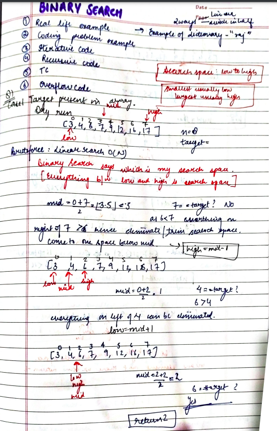
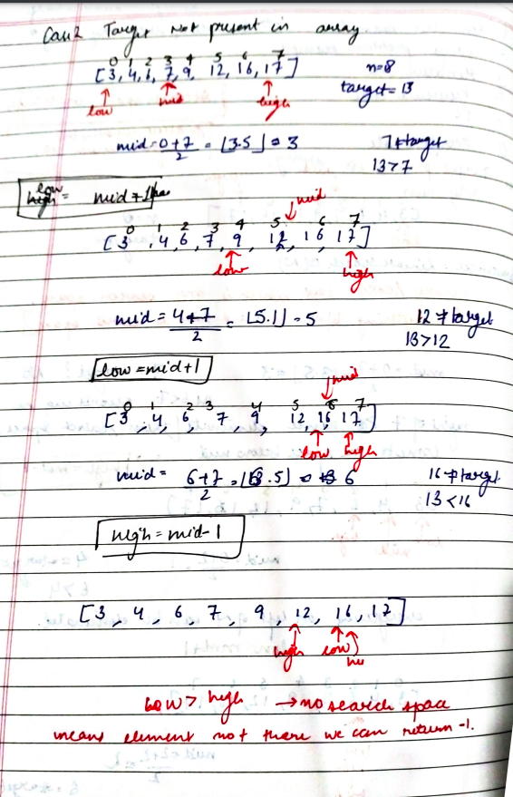

# Binary Search Introduction

[Detailed indepth explanation](https://takeuforward.org/data-structure/binary-search-explained/)

Given an array of integers nums which is sorted in ascending order, and an integer target, write a function to search target in nums. If target exists, then return its index. Otherwise, return -1.

You must write an algorithm with O(log n) runtime complexity.

```
Example 1:
Input: nums = [-1,0,3,5,9,12], target = 9
Output: 4
Explanation: 9 exists in nums and its index is 4


Example 2:
Input: nums = [-1,0,3,5,9,12], target = 2
Output: -1
Explanation: 2 does not exist in nums so return -1

```

---

## **Approach**:





## **Solution**:

### **Brute Force**:

Use Linear Search

Time Complexity: O(n)

Space Complexity O(1)

---

### **Best Approach**

#### Java

```Java
class Solution {
    public int search(int[] nums, int target) {
        int low=0;
        int high=nums.length-1;
        while(low<=high){
            int mid=low+((high-low)/2);
            if(nums[mid]==target){
                return mid;
            }
            else if (nums[mid]<target){
                low=mid+1;
            }
            else{
                high=mid-1;
            }
        }
    return -1;
    }
}

```

#### Python

```python


```

Time Complexity: O(logn)

Space Complexity O(1)

---

**Materials To Read/Watch**

1. [TUF explained BS](https://takeuforward.org/data-structure/binary-search-explained/)
