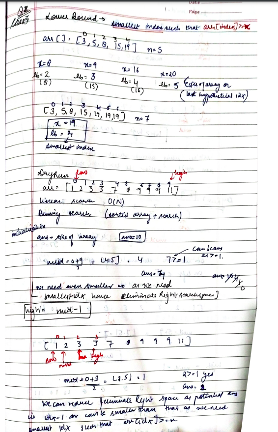
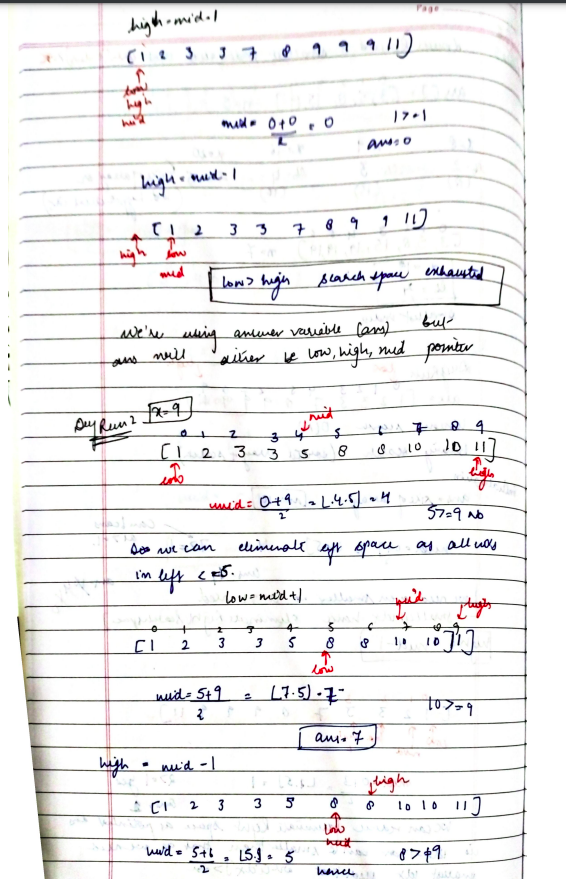
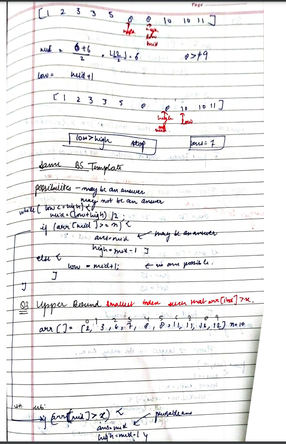
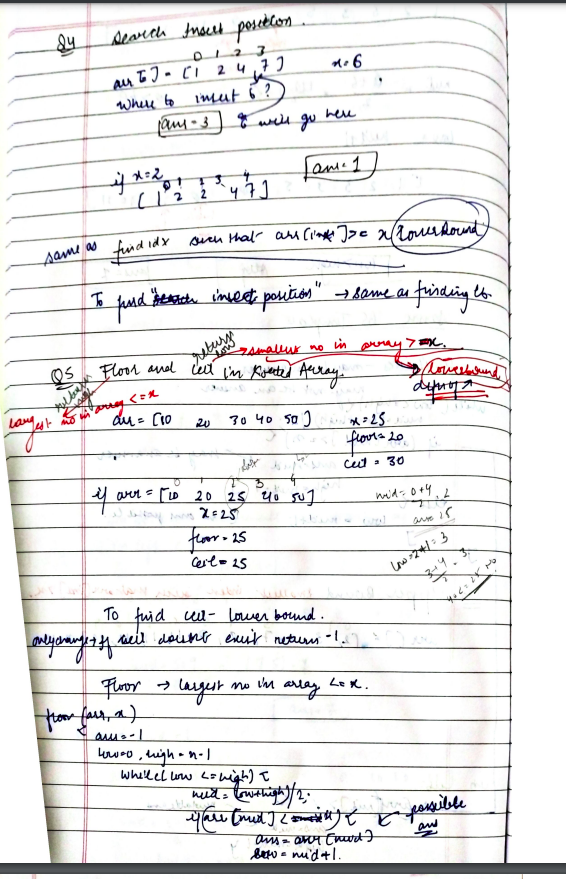
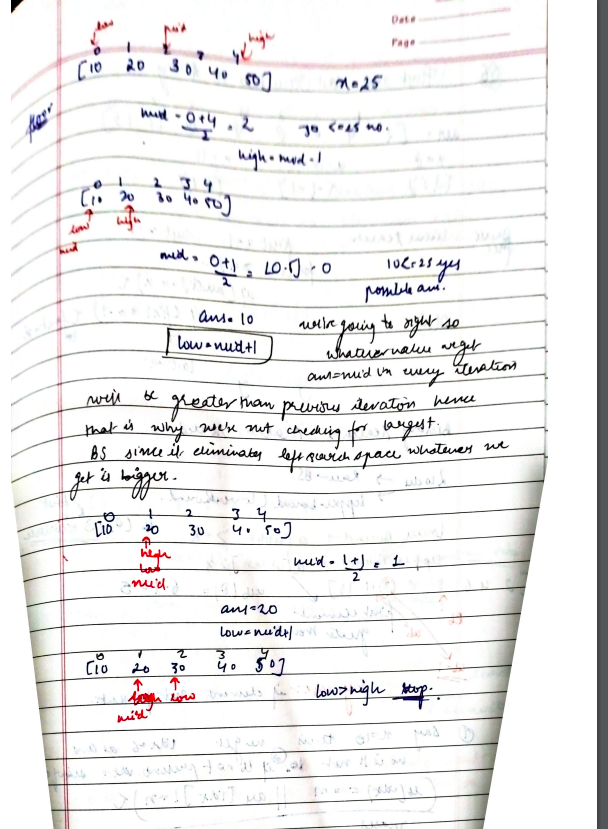

# Floor in a Sorted Array

[Detailed indepth explanation](https://takeuforward.org/arrays/implement-lower-bound-bs-2/)

Given a sorted array arr[] of size n without duplicates, and given a value x. Floor of x is defined as the largest element k in arr[] such that k is smaller than or equal to x. Find the index of k(0-based indexing).

[Problem Link](https://www.geeksforgeeks.org/problems/floor-in-a-sorted-array-1587115620/1?track=DSASP-Searching&amp%253BbatchId=154&utm_source=youtube&utm_medium=collab_striver_ytdescription&utm_campaign=floor-in-a-sorted-array)

```

Input: n = 7, x = 0 arr[] = {1,2,8,10,11,12,19}
Output: -1
Explanation: No element less than 0 is found. So output is "-1".


Input: n = 7, x = 5 arr[] = {1,2,8,10,11,12,19}
Output: 1
Explanation: Largest Number less than 5 is 2 (i.e k = 2), whose index is 1(0-based indexing).

```

---

## **Approach**:

## **CONCEPT OF LB, UP , FLoor and Ceil**











## **Solution**:

### **Brute Force**:

Use Linear Search

#### Java

```Java

import java.util.*;

public class Solution {

    public static int lowerBound(int []arr, int n, int x) {
        for (int i = 0; i < n; i++) {
            if (arr[i] >= x) {
                // lower bound found:
                return i;
            }
        }
        return n;
    }

    public static void main(String[] args) {
        int[] arr = {3, 5, 8, 15, 19};
        int n = 5, x = 9;
        int ind = lowerBound(arr, n, x);
        System.out.println("The lower bound is the index: " + ind);
    }
}


```

Time Complexity: O(n)

Space Complexity O(1)

---

### **Best Approach**

#### Java

```Java
class Solution {

    // Function to find floor of x
    // arr: input array
    // n is the size of array
    static int findFloor(long arr[], int n, long x) {

        int  low=0;
        int high=n-1;
        while(low<=high){
            int mid=(low+high)/2;
            if(arr[mid]<=x){
                low=mid+1;
            }
            else{
                high=mid-1;
            }
        }
        return high;


    }
}


```

#### Python

```python


```

Time Complexity: O(logn)

Space Complexity O(1)

---

**Materials To Read/Watch**

1. [TUF explained LB](https://takeuforward.org/arrays/implement-lower-bound-bs-2/)
