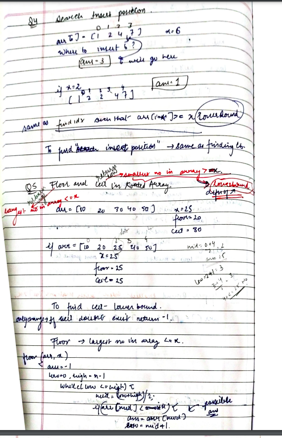

# Ceil The Floor

[Detailed indepth explanation](https://takeuforward.org/arrays/implement-upper-bound/)

Given an unsorted array arr[] of integers and an integer x, find the floor and ceiling of x in arr[].

Floor of x is the largest element which is smaller than or equal to x. Floor of x doesn’t exist if x is smaller than smallest element of arr[].
Ceil of x is the smallest element which is greater than or equal to x. Ceil of x doesn’t exist if x is greater than greatest element of arr[].

Return an array of integers denoting the [floor, ceil]. Return -1 as the floor or ceiling value if the floor or ceiling is not present.

[Problem Link](https://www.geeksforgeeks.org/problems/ceil-the-floor2802/1?utm_source=youtube&utm_medium=collab_striver_ytdescription&utm_campaign=ceil-the-floor)

```

Input: x = 7 , arr[] = [5, 6, 8, 9, 6, 5, 5, 6]
Output: 6, 8
Explanation: Floor of 7 is 6 and ceil of 7 is 8.

Input: x = 10 , arr[] = [5, 6, 8, 8, 6, 5, 5, 6]
Output: 8, -1
Explanation: Floor of 10 is 8 but ceil of 10 is not possible.

```

---

## **Approach**:

## **CONCEPT OF LB, UP , FLoor and Ceil**





## **Solution**:

### **Brute Force**:

Use Linear Search

#### Java

```Java

import java.util.*;

public class Solution {

    public static int upperBound(int[] arr, int x, int n) {
        for (int i = 0; i < n; i++) {
            if (arr[i] > x) {
                // upper bound found:
                return i;
            }
        }
        return n;
    }

    public static void main(String[] args) {
        int[] arr = {3, 5, 8, 9, 15, 19};
        int n = 6, x = 9;
        int ind = upperBound(arr, x, n);
        System.out.println("The upper bound is the index: " + ind);
    }
}

```

Time Complexity: O(n)

Space Complexity O(1)

---

### **Best Approach**

#### Java

```Java

//{ Driver Code Starts
import java.io.*;
import java.util.*;

public class Main {
    public static void main(String[] args) throws IOException {
        BufferedReader br = new BufferedReader(new InputStreamReader(System.in));
        int t = Integer.parseInt(br.readLine());

        while (t-- > 0) {
            int x = Integer.parseInt(br.readLine());
            String[] input = br.readLine().split(" ");
            int[] arr = new int[input.length];
            for (int i = 0; i < input.length; i++) {
                arr[i] = Integer.parseInt(input[i]);
            }

            Solution ob = new Solution();
            int[] ans = ob.getFloorAndCeil(x, arr);
            System.out.println(ans[0] + " " + ans[1]);
        }
    }
}

// } Driver Code Ends


// User function Template for Java

class Solution {
    public int getfloor(int [] arr, int x){
        int low=0;
        int  high=arr.length-1;
        while(low<=high){
            int mid=(low+high)/2;
            if(arr[mid]<=x){

                low=mid+1;
            }
            else{
                high=mid-1;
            }}

            return high;

    }
    public int getceil(int [] arr, int x){
        int low=0;
        int  high=arr.length-1;
        while(low<=high){
            int mid=(low+high)/2;
            if(arr[mid]<x){

                low=mid+1;
            }
            else{
                high=mid-1;
            }
        }
            return low;

    }
    public int[] getFloorAndCeil(int x, int[] arr) {
        Arrays.sort(arr);
        int [] ans=new int[2];
        ans[0]=-1;
        ans[1]=-1;
        int floor=getfloor( arr, x);
        if (floor!=-1){
            ans[0]=arr[floor];
        }

        int ceil=getceil(arr,  x);

        if (ceil!=arr.length){
         ans[1]=arr[ceil];
        }

        return ans;

    }

}

```

#### Python

```python


```

Time Complexity: O(logn)

Space Complexity O(1)

---

**Materials To Read/Watch**

1. [TUF explained LB](https://takeuforward.org/arrays/implement-upper-bound/)
