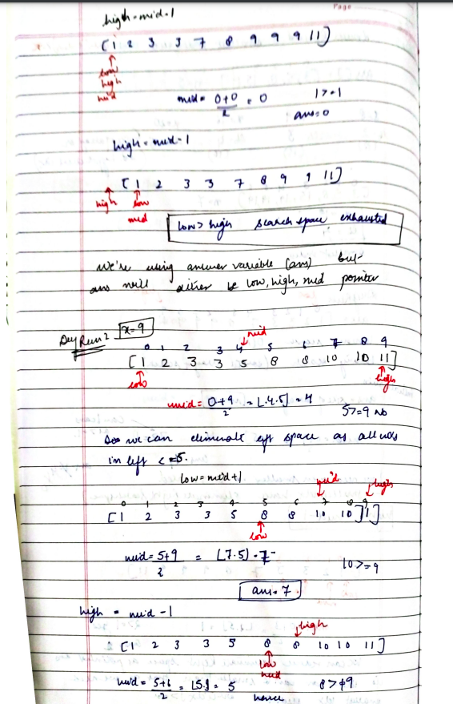
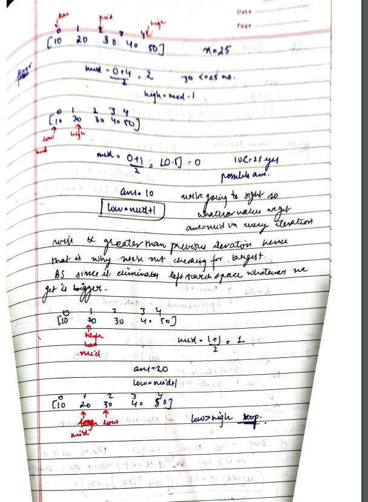

# Search Insert Position

[Detailed indepth explanation](https://takeuforward.org/arrays/search-insert-position/)

Given a sorted array of distinct integers and a target value, return the index if the target is found. If not, return the index where it would be if it were inserted in order.

You must write an algorithm with O(log n) runtime complexity.

[Problem Link](https://leetcode.com/problems/search-insert-position/description/)

```

Example 1:
Input: nums = [1,3,5,6], target = 5
Output: 2

Example 2:
Input: nums = [1,3,5,6], target = 2
Output: 1

Example 3:
Input: nums = [1,3,5,6], target = 7
Output: 4

```

---

## **Approach**:

## **CONCEPT OF LB, UP , FLoor and Ceil**







## **Solution**:

### **Brute Force**:

Use Linear Search

Time Complexity: O(n)

Space Complexity O(1)

---

### **Best Approach**

#### Java

```Java

class Solution {
    public int searchInsert(int[] nums, int target) {
        int low=0;
        int high=nums.length-1;
        while(low<=high){
            int  mid=(low+high)/2;
            if(nums[mid]>=target){
                high=mid-1;
            }
            else{
                low=mid+1;
            }
        }
        return low;
    }
}

```

#### Python

```python

class Solution:
    def searchInsert(self, nums: List[int], target: int) -> int:
        l=0
        r=len(nums)-1
        while(l<=r):
            mid=(l+r)//2
            if(nums[mid]<target):
                l=mid+1
            elif(nums[mid]>target):
                r=mid-1
            else:
                return mid
        return l


```

Time Complexity: O(logn)

Space Complexity O(1)

---

**Materials To Read/Watch**

1. [TUF explanation](https://takeuforward.org/arrays/search-insert-position/)
