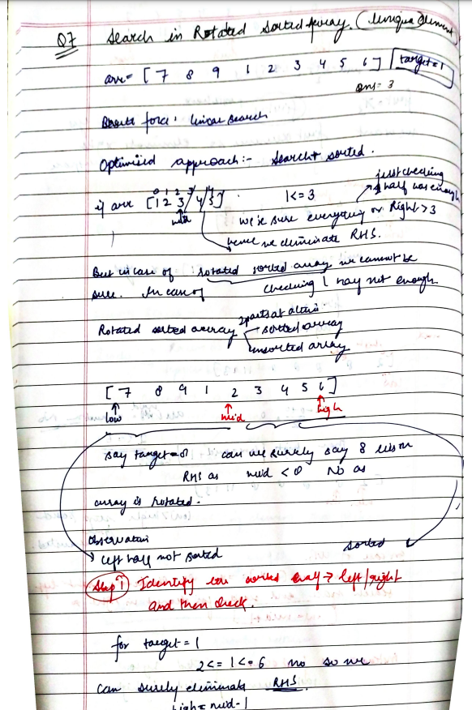
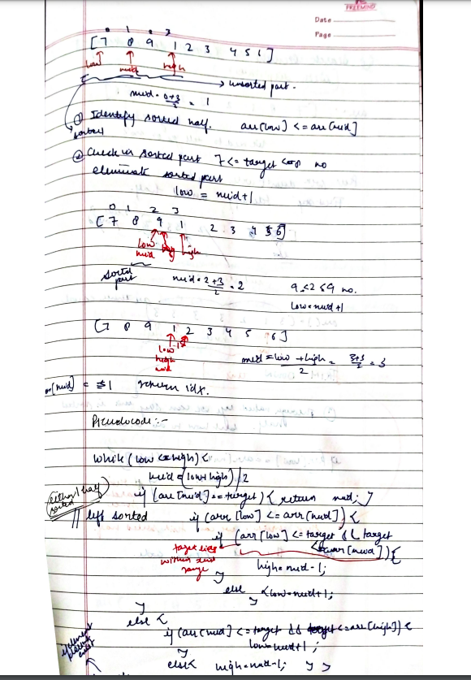

# Search in Rotated Sorted Array

[Detailed indepth explanation](https://takeuforward.org/data-structure/search-element-in-a-rotated-sorted-array/)

There is an integer array nums sorted in ascending order (with distinct values).

Prior to being passed to your function, nums is possibly rotated at an unknown pivot index k (1 <= k < nums.length) such that the resulting array is [nums[k], nums[k+1], ..., nums[n-1], nums[0], nums[1], ..., nums[k-1]] (0-indexed). For example, [0,1,2,4,5,6,7] might be rotated at pivot index 3 and become [4,5,6,7,0,1,2].

Given the array nums after the possible rotation and an integer target, return the index of target if it is in nums, or -1 if it is not in nums.

You must write an algorithm with O(log n) runtime complexity.

[Problem Link](https://leetcode.com/problems/search-in-rotated-sorted-array/description/)

```

Example 1:
Input: nums = [4,5,6,7,0,1,2], target = 0
Output: 4

Example 2:
Input: nums = [4,5,6,7,0,1,2], target = 3
Output: -1

Example 3:
Input: nums = [1], target = 0
Output: -1


```

---

## **Approach**:





## **Solution**:

### **Brute Force**:

Use Linear Search

1. We will traverse the array and check every element if it is equal to k. If we find any element, we will return its index.
2. Otherwise, we will return -1.

### Java

```Java


import java.util.*;

public class Solution {
    public static int search(ArrayList<Integer> arr, int n, int k) {
        for (int i = 0; i < n; i++) {
            if (arr.get(i) == k)
                return i;
        }
        return -1;
    }

    public static void main(String[] args) {
        ArrayList<Integer> arr = new ArrayList<>(Arrays.asList(7, 8, 9, 1, 2, 3, 4, 5, 6));
        int n = 9, k = 1;
        int ans = search(arr, n, k);
        if (ans == -1)
            System.out.println("Target is not present.");
        else
            System.out.println("The index is: " + ans);
    }
}


```

Time Complexity: O(n)

Space Complexity O(1)

---

### **Best Approach**

1. One part of the array will be always sorted and other will be unsorted.
2. first check if mid==target if yes then return
3. then see if the target lies in the sorted part if yes then search in the sorted part otherwise eliminite the sorted part.

#### Java

```Java

class Solution {
    public int search(int[] arr, int target) {
        int low=0;
        int high=arr.length-1;
        while(low<=high){
            int mid=(low+high)/2;
            if(arr[mid]==target){
                return mid;
            }
            else if(arr[low]<=arr[mid]){
                if(target>=arr[low] &&  target<arr[mid]){
                    high=mid-1;
                }
                else{
                    low=mid+1;
                }
            }
            else{
                if(target>arr[mid]&& target<=arr[high]){
                    low=mid+1;
                }
                else{
                    high=mid-1;
                }
            }


        }
         return -1;
    }
    }

```

#### Python

```python


```

Time Complexity: O(logn)

Space Complexity O(1)

---

**Materials To Read/Watch**

1. [TUF explanation](https://takeuforward.org/data-structure/search-element-in-a-rotated-sorted-array/)
