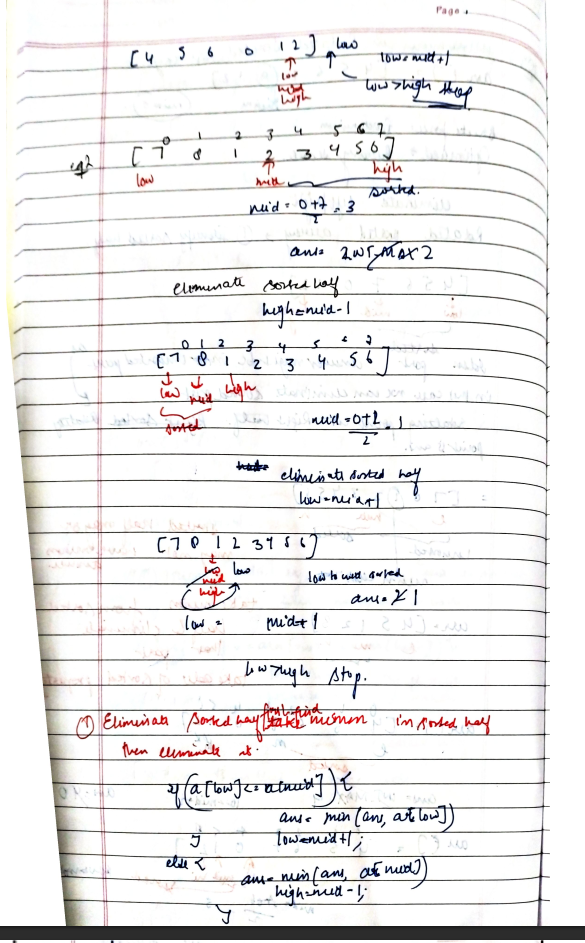

# Find Minimum in Rotated Sorted Array

[Detailed indepth explanation](https://takeuforward.org/data-structure/minimum-in-rotated-sorted-array/)

Suppose an array of length n sorted in ascending order is rotated between 1 and n times. For example, the array nums = [0,1,2,4,5,6,7] might become:

[4,5,6,7,0,1,2] if it was rotated 4 times.

[0,1,2,4,5,6,7] if it was rotated 7 times.

Notice that rotating an array [a[0], a[1], a[2], ..., a[n-1]] 1 time results in the array [a[n-1], a[0], a[1], a[2], ..., a[n-2]].

Given the sorted rotated array nums of unique elements, return the minimum element of this array.

You must write an algorithm that runs in O(log n) time.

[Problem Link](https://leetcode.com/problems/find-minimum-in-rotated-sorted-array/description/)

```

Example 1:
Input: nums = [3,4,5,1,2]
Output: 1
Explanation: The original array was [1,2,3,4,5] rotated 3 times.

Example 2:
Input: nums = [4,5,6,7,0,1,2]
Output: 0
Explanation: The original array was [0,1,2,4,5,6,7] and it was rotated 4 times.

Example 3:
Input: nums = [11,13,15,17]
Output: 11
Explanation: The original array was [11,13,15,17] and it was rotated 4 times.


```

---

## **Approach**:

## **Solution**:

### **Brute Force**:

The approach is simple. We will linearly search the entire array, and try to increase the counter whenever we get the target value in the array. Using a for loop that runs from 0 to n - 1, containing an if the condition that checks whether the value at that index equals target. If true then increase the counter, at last return the counter.

### Java

```Java

import java.util.*;

public class Solution {
    public static int count(int arr[], int n, int x) {
        int cnt = 0;
        for (int i = 0; i < n; i++) {

            // counting the occurrences:
            if (arr[i] == x) cnt++;
        }
        return cnt;
    }

    public static void main(String[] args) {
        int[] arr =  {2, 4, 6, 8, 8, 8, 11, 13};
        int n = 8, x = 8;
        int ans = count(arr, n, x);
        System.out.println("The number of occurrences is: " + ans);
    }
}


```

Time Complexity: O(n)

Space Complexity O(1)

---

### **Best Approach**





1. We will declare the ‘ans’ variable and initialize it with the largest value possible. With that, as usual, we will declare 2 pointers i.e. low and high.

2. Place the 2 pointers i.e. low and high: Initially, we will place the pointers like this: low will point to the first index, and high will point to the last index.
3. Calculate the ‘mid’: Now, inside a loop, we will calculate the value of ‘mid’ using the following formula:
   mid = (low+high) // 2 ( ‘//’ refers to integer division)
4. If arr[low] <= arr[high]: In this case, the array from index low to high is completely sorted. Therefore, we can select the minimum element, arr[low], and update the 'ans' variable with the minimum value i.e. min(ans, arr[low]). Once this is done, there is no need to continue with the binary search algorithm. So, we will break from this step.
5. Identify the sorted half, and after picking the leftmost element, eliminate that half.
   1. If arr[low] <= arr[mid]: This condition ensures that the left part is sorted. So, we will pick the leftmost element i.e. arr[low]. Now, we will compare it with 'ans' and update 'ans' with the smaller value (i.e., min(ans, arr[low])). Now, we will eliminate this left half(i.e. low = mid+1).
   2. Otherwise, if the right half is sorted: This condition ensures that the right half is sorted. So, we will pick the leftmost element i.e. arr[mid]. Now, we will compare it with 'ans' and update 'ans' with the smaller value (i.e., min(ans, arr[mid])). Now, we will eliminate this right half(i.e. high = mid-1).
6. This process will be inside a loop and the loop will continue until low crosses high. Finally, we will return the ‘ans’ variable that stores the minimum element.

#### Java

```Java

class Solution {
    public int findMin(int[] nums) {
        int idx=-1;
        int low=0;
        int high=nums.length-1;
        int minm=5001;
        while(low<=high){
            int mid=(low+high)/2;
            if(nums[low]<=nums[mid] && nums[mid]<=nums[high]){
              if(nums[low]<minm){
                return nums[low];
                }

            }
             if(nums[low]<=nums[mid]){

                if(nums[low]<minm){
                    minm=nums[low];
                }
                low=mid+1;
            }
            else{
                if(nums[mid]<minm){
                    minm=nums[mid];
                }
                high=mid-1;

            }
        }
     return minm;
    }
}

```

#### Python

```python


```

Time Complexity: O(logN), N = size of the given array.
Reason: We are basically using binary search to find the minimum.

Space Complexity O(1)

---

**Materials To Read/Watch**

1. [TUF explanation](https://takeuforward.org/data-structure/minimum-in-rotated-sorted-array/)
