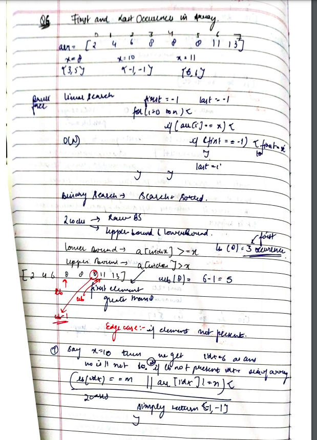
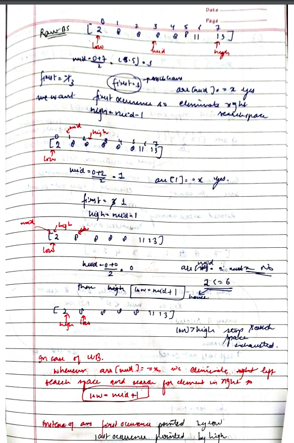

# Find First and Last Position of Element in Sorted Array

[Detailed indepth explanation](https://takeuforward.org/data-structure/last-occurrence-in-a-sorted-array/)

Given an array of integers nums sorted in non-decreasing order, find the starting and ending position of a given target value.

If target is not found in the array, return [-1, -1].

You must write an algorithm with O(log n) runtime complexity.

[Problem Link](https://leetcode.com/problems/find-first-and-last-position-of-element-in-sorted-array/description/)

```

Example 1:
Input: nums = [5,7,7,8,8,10], target = 8
Output: [3,4]

Example 2:
Input: nums = [5,7,7,8,8,10], target = 6
Output: [-1,-1]

Example 3:
Input: nums = [], target = 0
Output: [-1,-1]

```

---

## **Approach**:





## **Solution**:

### **Brute Force**:

1. As the array is already sorted, start traversing the array from the back using a for loop and check whether the element is present or not.
2. If the target element is present, break out of the loop and print the resulting index.
3. If the target element is not present inside the array, then print -1

### Java

```Java
public class Solution {
  public static int solve(int n, int key, int[] v) {
    int res = -1;
    for (int i = n - 1; i >= 0; i--) {
      if (v[i] == key) {
        res = i;
        break;
      }
    }
    return res;
  }
  public static void main(String args[]) {
    int n = 7;
    int key = 13;
    int[] v = {3,4,13,13,13,20,40};

    // returning the last occurrence index if the element is present otherwise -1
    System.out.println(solve(n, key, v));
  }
}
```

Time Complexity: O(n)

Space Complexity O(1)

---

### **Best Approach**

As given in the question, the array is already sorted

- Whenever the word “sorted” or other similar terminologies are used in an array question, BINARY SEARCH can be one of the approaches.

1. Initially consider the start=0 and the end=n-1 pointers and the result as -1.

2. Till start does not crossover end pointer compare the mid element

3. If the mid element is equal to the key value, store the mid-value in the result and move the start pointer to mid+1(move leftward)

4. Else if the key value is less than the mid element then end= mid-1(move leftward)

5. Else do start = mid+1 (move rightwards)

#### Java

```Java

class Solution {
    public int[] searchRange(int[] nums, int target) {

       int l=0;
       int r=nums.length -1;
       int fo=-1;
       int lo=-1;
       while(l<=r){
       int mid=(l+r)/2;

        if(nums[mid]>target){
            r=mid-1;
        }
        else if(nums[mid]<target){
            l=mid+1;
        }
        else{
            fo=mid;
            r=mid-1;
        }
       }


l=0;
r=nums.length-1;
    while(l<=r){
       int mid=(l+r)/2;

        if(nums[mid]>target){
            r=mid-1;
        }
        else if(nums[mid]<target){
            l=mid+1;
        }
        else{
            lo=mid;
            l=mid+1;
        }
       }
       int ans[]={fo,lo};
       return ans;
    }
}

```

#### Python

```python

class Solution:

    def searchRange(self, nums: List[int], target: int) -> List[int]:
        ans=[-1,-1]
        def find_range(nums,target):
            ans[0]=search(nums,target,True)
            if ans[0]!=-1:
                ans[1]=search(nums,target,False)
        def search(nums,target,findstartindex):
            s_ans=-1
            start=0
            end=len(nums)-1
            while(start<=end):
                mid=start+(end-start)//2
                if target<nums[mid]:
                    end=mid-1
                elif target>nums[mid]:
                    start=mid+1
                else:
                    s_ans=mid #potential ans
                    if(findstartindex):
                        end=mid-1
                    else:
                        start=mid+1
            return s_ans
        find_range(nums,target)
        return ans


```

Time Complexity: O(2\*logN), where N = size of the given array.
Reason: We are basically using the binary search algorithm twice.

Space Complexity O(1)

---

**Materials To Read/Watch**

1. [TUF explanation](https://takeuforward.org/data-structure/last-occurrence-in-a-sorted-array/)
