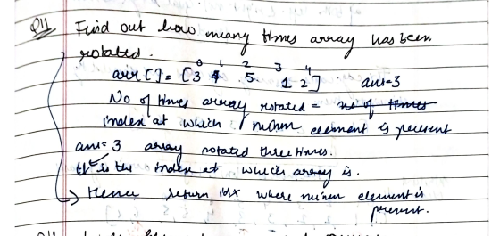

# Find Kth Rotation

[Detailed indepth explanation](https://takeuforward.org/arrays/find-out-how-many-times-the-array-has-been-rotated/)

Given a increasing sorted rotated array arr of distinct integers. The array is right-rotated k times. Find the value of k.
Let's suppose we have an array arr = [2, 4, 6, 9], so if we rotate it by 2 times so that it will look like this:
After 1st Rotation : [9, 2, 4, 6]
After 2nd Rotation : [6, 9, 2, 4]

[Problem Link](https://www.geeksforgeeks.org/problems/rotation4723/1?utm_source=youtube&utm_medium=collab_striver_ytdescription&utm_campaign=rotation)

```

Input: arr = [5, 1, 2, 3, 4]
Output: 1
Explanation: The given array is 5 1 2 3 4. The original sorted array is 1 2 3 4 5. We can see that the array was rotated 1 times to the right.

Input: arr = [1, 2, 3, 4, 5]
Output: 0
Explanation: The given array is not rotated.


```

---

## **Approach**:



## **Solution**:

### **Brute Force**:

1. First, we will declare an ‘ans’ and an ‘index’ variable initialized with a large number and -1 respectively.
2. Next, we will iterate through the array and compare each element with the variable called ‘ans’. Whenever we encounter an element 'arr[i]' that is smaller than ‘ans’, we will update ‘ans’ with the value of 'arr[i]' and also update the 'index' variable with the corresponding index value, 'i'.
3. Finally, we will return ‘index’ as our answer.

### Java

```Java

import java.util.*;

public class Solution {
    public static int findKRotation(int[] arr) {
        int n = arr.length; //size of array.
        int ans = Integer.MAX_VALUE, index = -1;
        for (int i = 0; i < n; i++) {
            if (arr[i] < ans) {
                ans = arr[i];
                index = i;
            }
        }
        return index;
    }

    public static void main(String[] args) {
        int[] arr = {4, 5, 6, 7, 0, 1, 2, 3};
        int ans = findKRotation(arr);
        System.out.println("The array is rotated " + ans + " times.");
    }
}

```

Time Complexity: O(n)

Space Complexity O(1)

---

### **Best Approach**

No of times array is rotated is the idx at which minm element is present.

#### Java

```Java

//{ Driver Code Starts
// Initial Template for Java

import java.io.*;
import java.util.*;

class GFG {
    // Driver code
    public static void main(String[] args) throws Exception {
        Scanner sc = new Scanner(System.in);
        int t = Integer.parseInt(sc.nextLine());
        while (t-- > 0) {
            List<Integer> arr = new ArrayList<>();
            String input1 = sc.nextLine();
            Scanner ss1 = new Scanner(input1);
            while (ss1.hasNextInt()) {
                arr.add(ss1.nextInt());
            }
            Solution ob = new Solution();
            int res = ob.findKRotation(arr);
            System.out.println(res);
        }
    }
}


// User function Template for Java

class Solution {
    public int findKRotation(List<Integer> arr) {
        // Code here
        int idx=0;
        int low=0;
        int high=arr.size()-1;
        int minm =9999999;
        while(low<=high){
            int mid=(low+high)/2;
            if(arr.get(low)<=arr.get(mid) && arr.get(mid)<=arr.get(high)){
                if(arr.get(low)<=minm){
                return low;
                }
                low=mid+1;

            }
            else if(arr.get(low)<=arr.get(mid)){
                if(arr.get(low)<=minm){
                    idx=low;
                    minm=arr.get(low);
                }
                low=mid+1;


            }
            else{
                if(arr.get(mid)<=minm){
                    idx=mid;
                    minm=arr.get(mid);
                }
                high=mid-1;
            }
        }
        return idx;
    }
}

```

#### Python

```python


```

Time Complexity: O(logN), N = size of the given array.
Reason: We are basically using binary search to find the minimum.

Space Complexity O(1)

---

**Materials To Read/Watch**

1. [TUF explanation](hhttps://takeuforward.org/arrays/find-out-how-many-times-the-array-has-been-rotated/)
