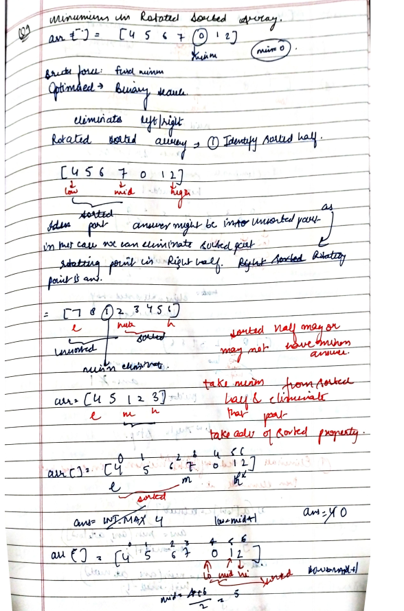
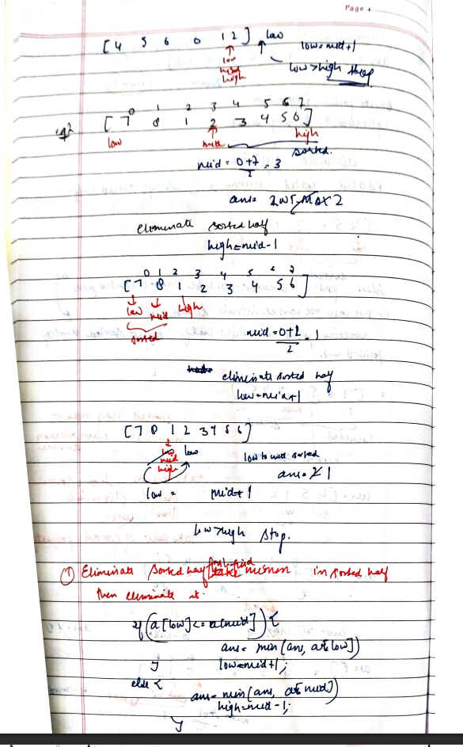
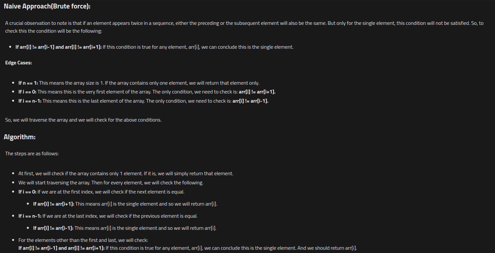

# Search Single Element in a sorted array

[Detailed indepth explanation](https://takeuforward.org/data-structure/search-single-element-in-a-sorted-array/)

You are given a sorted array consisting of only integers where every element appears exactly twice, except for one element which appears exactly once.

Return the single element that appears only once.

Your solution must run in O(log n) time and O(1) space.

[Problem Link](https://leetcode.com/problems/single-element-in-a-sorted-array/description/)

```

Example 1:
Input: nums = [1,1,2,3,3,4,4,8,8]
Output: 2

Example 2:
Input: nums = [3,3,7,7,10,11,11]
Output: 10


```

---

## **Approach**:




## **Solution**:

### **Brute Force**:



### Java

```Java


import java.util.*;

public class Solution {
    public static int singleNonDuplicate(ArrayList<Integer> arr) {
        int n = arr.size(); // Size of the array.
        if (n == 1)
            return arr.get(0);

        for (int i = 0; i < n; i++) {
            // Check for first index:
            if (i == 0) {
                if (!arr.get(i).equals(arr.get(i + 1)))
                    return arr.get(i);
            }
            // Check for last index:
            else if (i == n - 1) {
                if (!arr.get(i).equals(arr.get(i - 1)))
                    return arr.get(i);
            } else {
                if (!arr.get(i).equals(arr.get(i - 1)) && !arr.get(i).equals(arr.get(i + 1)))
                    return arr.get(i);
            }
        }

        // Dummy return statement:
        return -1;
    }

    public static void main(String[] args) {
        ArrayList<Integer> arr =
            new ArrayList<>(Arrays.asList(1, 1, 2, 2, 3, 3, 4, 5, 5, 6, 6));
        int ans = singleNonDuplicate(arr);
        System.out.println("The single element is: " + ans);
    }
}


```

Time Complexity: O(n)

Space Complexity O(1)

---

### **Best Approach**

1. Check for edge cases first check if array has only 1 element if yes then return. Another edge case is to check element at start and end. Then take low=1, high=n-2 to avoid overflow cases.
2. Use BS, check if mid !=mid+1 or mid!=mid-1. if yes you found single element return .
3. If not, Check wether we're standing in left half or right half. If standing at left eliminate it and move to right and vice versa.

How do you eliminate?

- take advantage of even odd and sorted property.
  1 1 2 2 3 4 4 5 5
  (e o) (p,e)

#### Java

```Java

class Solution {
    public int singleNonDuplicate(int[] nums) {
        if(nums.length==1){
            return nums[0];
        }
        if(nums[0]!=nums[1]){
            return nums[0];
        }
        int n=nums.length;
        if(nums[n-1]!=nums[n-2]){
            return nums[n-1];
        }
        int low=1;
        int high=n-2;
        while(low<=high){
            int mid=(low+high)/2;
            if(nums[mid]!=nums[mid-1] && nums[mid]!=nums[mid+1]){
                return nums[mid];
            }
            else if(mid%2==0  ){
                if(nums[mid]==nums[mid+1]){
 low=mid+1;
                }
                else{
                    high=mid-1;
                }

            }
            else{
                if(nums[mid]==nums[mid+1]){
                    high=mid-1;
                }
                else{
                    low=mid+1;
                }
            }
        }
        return -1;


    }
}


```

### JAVA CLEAN CODE

```Java

class Solution {
    public int singleNonDuplicate(int[] nums) {

       int n=nums.length;
       int l=0;
       int r=n-1;
       while(l<r){
        int mid=(l+r)/2;
        if(nums[mid]==nums[mid^1]){
            l=mid+1;
        }
        else{
            r=mid;
        }
       }
return nums[l];
    }
}


```

#### Python

```python


```

Time Complexity: O(logN), N = size of the given array.
Reason: We are basically using binary search to find the minimum.

Space Complexity O(1)

---

**Materials To Read/Watch**

1. [TUF explanation](https://takeuforward.org/data-structure/search-single-element-in-a-sorted-array/)
