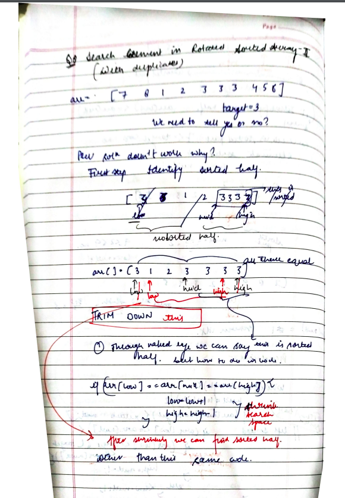

# Search in Rotated Sorted Array-II

[Detailed indepth explanation](https://takeuforward.org/arrays/search-element-in-rotated-sorted-array-ii/)

There is an integer array nums sorted in non-decreasing order (not necessarily with distinct values).

Before being passed to your function, nums is rotated at an unknown pivot index k (0 <= k < nums.length) such that the resulting array is [nums[k], nums[k+1], ..., nums[n-1], nums[0], nums[1], ..., nums[k-1]] (0-indexed). For example, [0,1,2,4,4,4,5,6,6,7] might be rotated at pivot index 5 and become [4,5,6,6,7,0,1,2,4,4].

Given the array nums after the rotation and an integer target, return true if target is in nums, or false if it is not in nums.

You must decrease the overall operation steps as much as possible.

[Problem Link](https://leetcode.com/problems/search-in-rotated-sorted-array-ii/description/)

```

Example 1:
Input: nums = [2,5,6,0,0,1,2], target = 0
Output: true

Example 2:
Input: nums = [2,5,6,0,0,1,2], target = 3
Output: false


```

---

## **Approach**:



## **Solution**:

### **Brute Force**:

Use Linear Search

1. We will traverse the array and check every element if it is equal to k. If we find any element, we will return True.
2. Otherwise, we will return False.

### Java

```Java


import java.util.*;

public class Solution {
    public static boolean searchInARotatedSortedArrayII(int []arr, int k) {
        int n = arr.length; // size of the array.
        for (int i = 0; i < n; i++) {
            if (arr[i] == k) return true;
        }
        return false;
    }

    public static void main(String[] args) {
        int[] arr = {7, 8, 1, 2, 3, 3, 3, 4, 5, 6};
        int k = 3;
        boolean ans = searchInARotatedSortedArrayII(arr, k);
        if (ans == false)
            System.out.println("Target is not present.");
        else
            System.out.println("Target is present in the array.");
    }
}


```

Time Complexity: O(N), N = size of the given array.

Reason: We have to iterate through the entire array to check if the target is present in the array.

Space Complexity O(1)
Reason: We have not used any extra data structures, this makes space complexity, even in the worst case as O(1).

---

### **Best Approach**

1. One part of the array will be always sorted and other will be unsorted.
2. first check if mid==target if yes then return
3. if arr[low]==arr[mid]==arr[high] eliminate duplicates, do low++, high-- and continue.
4. then see if the target lies in the sorted part if yes then search in the sorted part otherwise eliminite the sorted part.

#### Java

```Java

class Solution {
    public boolean search(int[] arr, int target) {
        int low=0;
        int high=arr.length-1;
        while(low<=high){
            int mid=(low+high)/2;
            if(arr[mid]==target){
                return true;
            }
            else if (arr[low]==arr[mid] && arr[mid]==arr[high]){
                low+=1;
                high-=1;
                continue;
            }
            else if(arr[low]<=arr[mid]){
                if(target>=arr[low] &&  target<arr[mid]){
                    high=mid-1;
                }
                else{
                    low=mid+1;
                }
            }
            else{
                if(target>arr[mid]&& target<=arr[high]){
                    low=mid+1;
                }
                else{
                    high=mid-1;
                }
            }


        }
         return false;
    }
    }


```

#### Python

```python


```

Time Complexity: O(logn)

Space Complexity O(1)

---

**Materials To Read/Watch**

1. [TUF explanation](https://takeuforward.org/arrays/search-element-in-rotated-sorted-array-ii/)
