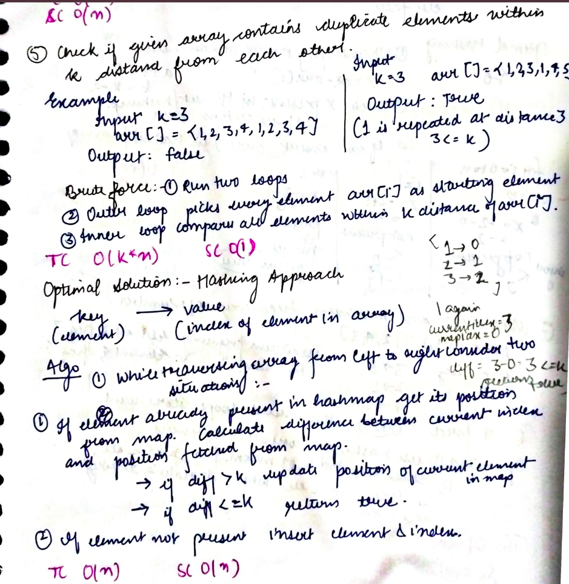

# Check if the given array contains duplicate elements within k distance from each other

Problem: Check if the following given array contains duplicate elements within k distance from each other.

---

```
Example-1:

Input: k = 3, arr[] = {1, 2, 3, 4, 1, 2, 3, 4}

Output: false

All duplicates are more than k(3) distance away.

1...1(has a distance of 4)

2...2(has a distance of 4)

3...3 and 4...4 are similar

Even if we find one duplicate number having a distance less than equal to k(<=k), we would return true.


Example-2:

Input: k = 3, arr[] = {1, 2, 3, 1, 4, 5}

Output: true

1 is repeated at distance 3(3<=k hence we return true).


```

## **Approach**:



## **Solution**:

### **Brute Force**:

A Naive solution is to run two loops. The outer loop picks every element ‘arr[i]’ as a starting element, and the inner loop compares all elements which are within k distance of ‘arr[i]’.

### Java

```java
bool checkDuplicatesWithinK(int arr[], int n, int k)
{

 for(int i=0; i<n ;i++)//outer loop
	  {
	      for(int j=i+1; j<=i+k&&j<n; j++)//inner loop
	      {
	          if(arr[i]==arr[j]){
	              if((j-i)<=k)return true;
	          }
	      }
	  }
	  return false;


}
```

Time Complexity: O(k^n)

Space Complexity O(1)

---

### **Best Approach**

In order to make optimization first, we need to figure out what kind of repetitive work we are doing. In our brute force, we are iterating an array over and over again so we need to remove this work.
Here the "Hashing" comes into the picture.

We can use the map or set depending on the problem statement.

Here we will be using the unordered map which contains

key--> element of an array

value--> index of element in array

#### Java

```Java
public class Solution {
    static boolean check_duplicates_within_k_distance(int[] arr, int k) {
        HashMap<Integer, Integer> map = new HashMap<>();

        for (int i = 0; i < arr.length; i++) {

            if (map.containsKey(arr[i])) {
                int prev = map.get(arr[i]);
                if (i - prev <= k) {
                    return true;
                }
            }
            map.put(arr[i], i);

        }
        return false;
    }
}
```

#### Python

```python

from collections import defaultdict
def checkduplicateswithinkdistance(arr,k):
    # Dictionary to store the most recent index of each value
    map=defaultdict(lambda:-k-1)
    for i,num in enumerate(arr):
        if i-map[num]<=k:
            return True
        map[num]=i
    return False


n=int(input())
arr=[int(x) for x in input().split()]
k=int(input())
ans=checkduplicateswithinkdistance(arr,k)
if(ans):
    print("Duplicates present at distance k")
else:
    print("Duplicates Not present at distance k")


```

Time Complexity: O(n)

Space Complexity O(n)

---

**Materials To Read/Watch**
