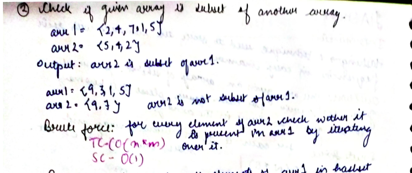

# Check given array is subset of another array or not

Given two arrays, arr1 and arr2, check if arr2 is a subset of arr1. You can assume there are no duplicates in both the arrays.

---

## **Input**:

```
Input:

arr1 = {2,4,7,1,5}

arr2 = {5,4,2}

Output: arr2 is a subset of arr1

(since all elements of arr2 are present in arr1)


Example-2:

Input:

arr1 = {9,3,1,5}

arr2 = {9,7}

Output: arr2 is not a subset of arr1

(since 7 is not present in arr1)

```

## **Solution**:

### **Brute Force**:



#### Java

```java

package Java.Hashing;

import java.util.Scanner;

public class CheckSubset_brute {
    static boolean checksubset(int[] arr1, int[] arr2) {
        for (int i = 0; i < arr2.length; i++) {
            boolean present = false;
            for (int j = 0; j < arr1.length; j++) {
                if (arr2[i] == arr1[j]) {
                    present = true;
                }
            }
            if (!present) {
                return false;
            }

        }
        return true;
    }

    public static void main(String[] args) {
        Scanner scn = new Scanner(System.in);
        int n = scn.nextInt();
        int arr1[] = new int[n];
        for (int i = 0; i < n; i++) {
            arr1[i] = scn.nextInt();

        }
        int m = scn.nextInt();
        int arr2[] = new int[m];
        for (int j = 0; j < m; j++) {
            arr2[j] = scn.nextInt();
        }

        boolean ans = checksubset(arr1, arr2);

        if (ans) {
            System.out.println("arr2 is subset of arr1");
        } else {
            System.out.println("arr2 is NOT subset of arr1");

        }
    }
}

```

Time Complexity: O(n\*m)

Space Complexity O(1)

---

### **Optimized Approach**


#### Java

```java

class Solution{
static void checksubset_using_Hashset(int[] arr1, int[] arr2) {
        // This function doesn't works for this case: Check if a given array is a subset
        // of another array. Duplicate elements can be present.
        /*
         *
         * Example-2:
         *
         * Input:
         *
         * arr1 = {9,3,1,5,2,1}
         *
         * arr2 = {9,1,1,1}
         *
         * Output: arr2 is not a subset of arr1
         *
         * Explanation: Element 1 is present twice in arr1 and thrice in arr2.
         */
        Set<Integer> st = new HashSet<>();
        for (int i = 0; i < arr1.length; ++i) {
            st.add(arr1[i]);
        }

        for (int i = 0; i < arr2.length; ++i) {
            if (!st.contains(arr2[i])) {
                System.out.println("Arr2 is not a subset of Arr1");

            }
        }
        System.out.println("Arr2 is a subset of Arr1");
    }
}

```

---

#### Python

```python


def checksubset(arr1,arr2):
    hashset=set(arr1)
    for ele in arr2:
        if ele not in hashset:
            print("arr2 is not subset of arr1")
            break
    print("arr2 is subset of arr1")

if __name__=="__main__":
    n=input("Enter size of array 1")
    ip_arr1=input("Enter array 1")
    arr1=[ int(x) for x in ip_arr1.split()]
    m=input("Enter size of array 2")
    ip_arr2=input("Enter array 2")
    arr2=[ int(x) for x in ip_arr2.split()]
    checksubset(arr1,arr2)


```

Time Complexity: O(n+m)

Space Complexity O(n)

---

**Materials To Read**

In the above approach, in order to check whether the element is present in arr1, we have used hashset. Time complexity to for this is O(1) in average, but O(n) in worst case. So the overall time complexity is greater than O(n + m). We can instead use vector<bool> and store true/false at the respective index of element. This approach will perform better compared to approach 2. This approach will work only when array elements are of order less than or equal to 107. We always prefer vector<bool> over array of bools because of internal optimized implementation of vector of bools.

- [ ] Improvised Hashing approach for solving this question
