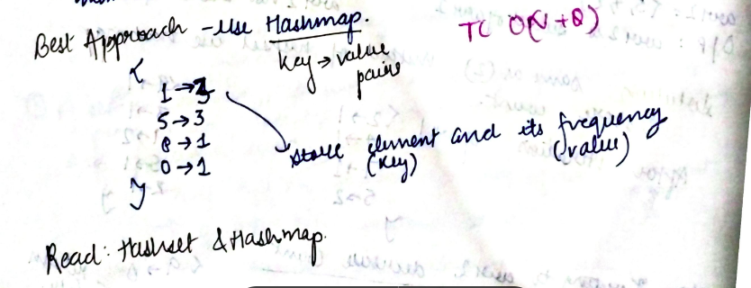

# Frequency of Element in an Array

You are given an array of size `n` ; you are also given `Q` queries for each of the query please tell how many times a given number occurs in the array

---

## **Solution**:

### **Brute Force**:


#### Java

```java
package Java.Hashing;

import java.util.Scanner;

public class Frequency {
    static int solution(int[] arr, int query) {
        int count = 0;
        for (int i = 0; i < arr.length; i++) {
            if (arr[i] == query) {
                count++;
            }

        }
        return count;

    }

    public static void main(String[] args) {
        Scanner scn = new Scanner(System.in);
        int n = scn.nextInt();
        int[] array = new int[5];
        for (int i = 0; i < n; i++) {
            array[i] = scn.nextInt();
        }
        int q = scn.nextInt();
        for (int i = 0; i < q; i++) {
            int query = scn.nextInt();
            int count = solution(array, query);
            System.out.println("Frequency of element " + query + " is " + count);
        }
    }

}

```

Time Complexity: O(n\*q)

Space Complexity O(1)

---

### **Better Approach**


Drawback:
The space complexity can be very big if elements in the array big like 10^6 or 10^7 or 10^8 in that case you will have to make hash[] of size 10^6 or 10^7 or 10^8 which will be very inefficient because it takes lots; of space!

#### Java

```java
package Java.Hashing;

import java.util.Arrays;
import java.util.Scanner;

public class Frequency_Better

{

    public static void main(String[] args) {
        Scanner scn = new Scanner(System.in);
        int n = scn.nextInt();
        int[] array = new int[5];
        int[] map = new int[100];
        Arrays.fill(map, 0);

        for (int i = 0; i < n; i++) {
            array[i] = scn.nextInt();
            map[array[i]] += 1;
        }

        int q = scn.nextInt();
        for (int i = 0; i < q; i++) {
            int query = scn.nextInt();
            int count = map[query];

            System.out.println("Frequency of element " + query + " is " + count);
        }
    }

}


```

**_Output_**

```
5
1 2 1 3 4
2
1 5
Frequency of element 1 is 2
Frequency of element 5 is 0

```

Time Complexity: O(n+q)

Space Complexity O(m) where m is the largest number in array

---

### **Best Approach**

#### Java



```Java
package Java.Hashing;

import java.util.*;
import java.io.*;
import java.text.*;
import java.util.regex.*;

public class Hashmap {
    public static void main(String[] args) {

        Scanner scn = new Scanner(System.in);
        int n = scn.nextInt();
        int arr[] = new int[n];
        HashMap<Integer, Integer> map = new HashMap<>();

        for (int i = 0; i < n; i++) {
            arr[i] = scn.nextInt();
            int freq = map.getOrDefault(arr[i], 0);
            map.put(arr[i], freq + 1);
        }
        int m = scn.nextInt();
        int q[] = new int[m];
        for (int j = 0; j < m; j++) {
            q[j] = scn.nextInt();
            if (map.containsKey(q[j])) {
                System.out.println("Frequency of " + q[j] + " is " + map.get(q[j]));
            }
        }

    }
}

```

#### Python

```python

# Read the number of elements
n = int(input())

# Read the input line and convert it to a list of integers
input_line = input()
arr = [int(x) for x in input_line.split()]

# Create a dictionary to store the frequency of each element
frequency_map = {}
for ele in arr:
    frequency_map[ele] = frequency_map.get(ele, 0) + 1

# Read the number of queries
q = int(input())

# Process each query and print the frequency of the queried element
for _ in range(q):
    query = int(input())
    print(f"Frequency of {query} is {frequency_map.get(query, 0)}")


```

Time Complexity: O(n)

Space Complexity O(n)

---

**Materials To Read**

1. [Dictionary in Python ](https://docs.python.org/3/library/stdtypes.html#mapping-types-dict)
2. [Dictionary in Python-GFG Article](https://www.geeksforgeeks.org/python-dictionary/)
3. [Set In Python](https://realpython.com/python-sets/)
4. [HashMap In Java](https://www.baeldung.com/java-hashmap)
5. [Hashset In Java-1](https://www.simplilearn.com/tutorials/java-tutorial/hashset-in-java)
6. [Hashset In Java-2](https://www.baeldung.com/java-hashset)
7. [Hashing Amazing Resource] (https://www.desiqna.in/hashing+find+frequency+of+each+number+in+the+array)
