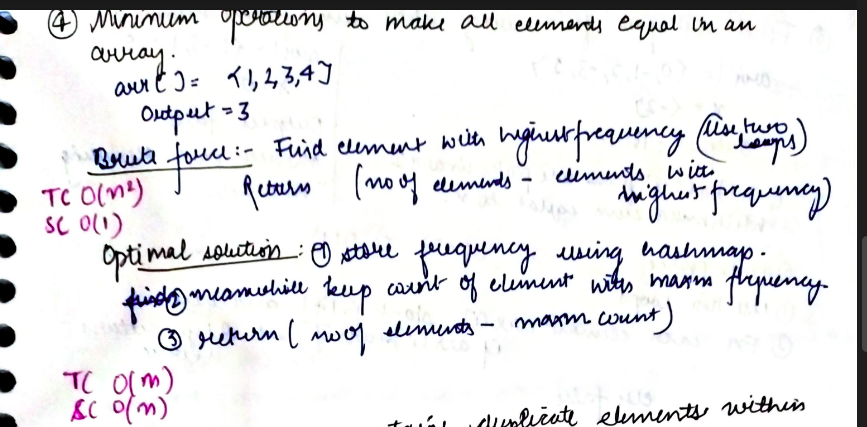

# Minimum operations to make all elements equal in an array

Given an array consisting of positive integers, return the minimum number of operations to make all the elements of the array equal. The operations can be addition, multiplication, division, or subtraction.

---

## **Logic**:

In order to make all the elements equal, we will be selecting a value from the array(the target element) and converting the rest of the elements into the selected element. Now, how should we be selecting the target element? The target element will be the element that has the highest frequency in the array.

Let's say the element with the highest frequency occurs k times. Thus, we would require at least n-k operations for making all the array elements equal. Here n is the size of the array.

---

## **Approach**:

## 

## **Solution**:

### **Brute Force**:

To find the element with the highest frequency, we will run two loops. The outer loop picks all the elements one by one and the inner loop finds the frequency of the picked element and compares it with the element with the highest frequency so far. If it is greater, it replaces to be the highest frequent element. After this, we will simply return the "number of elements - frequency of the most frequent element".

Time Complexity: O(n^2)

Space Complexity O(1)

---

Hashing Approach

We can minimize the work done in the above approach by using a hash map. A hash map is nothing but a map that consists of the frequency of all the elements in the array. The highest frequent element in the hash table will be our target element and thus, our answer will be "number of elements - frequency of the target element".

### **Best Approach**

#### Java

```Java
import java.io.*;
import java.math.*;
import java.util.regex.*;
import java.util.*;

public class two_minimumoperations {
    static int minimum_operations(int[] arr) {
        HashMap<Integer, Integer> map = new HashMap<>();
        int max = 0;
        for (int i = 0; i < arr.length; i++) {
            int freq = map.getOrDefault(arr[i], 0);
            map.put(arr[i], freq + 1);
            if (freq + 1 > max) {
                max = freq + 1;
            }

        }
        return (arr.length - max);
    }

    public static void main(String[] args) {
        Scanner scn = new Scanner(System.in);
        int n = scn.nextInt();
        int arr[] = new int[n];
        for (int i = 0; i < n; i++) {
            arr[i] = scn.nextInt();
        }
        int ans = minimum_operations(arr);
        System.out.println("mininum no of operations required are: " + ans);
    }
}


```

#### Python

```python

from collections import defaultdict
arr=[1,2,1,4,3,1]
n=len(arr)
map=defaultdict(int)
for i in range(n):
    map[arr[i]]+=1
maxmfreq=0

for key,val in map.items():
    if val>maxmfreq:
        maxmfreq=val
print(f"The mininmum no of operations required to make all elements equal is: {n-maxmfreq}")


```

Time Complexity: O(n)

Space Complexity O(n)

---

**Materials To Read/Watch**

1. [Default Dictionary in Python](https://realpython.com/python-defaultdict/)

2. [Collections module in Python](https://realpython.com/python-collections-module/)

3. [Collections in Java](https://www.youtube.com/watch?v=rzA7UJ-hQn4)
