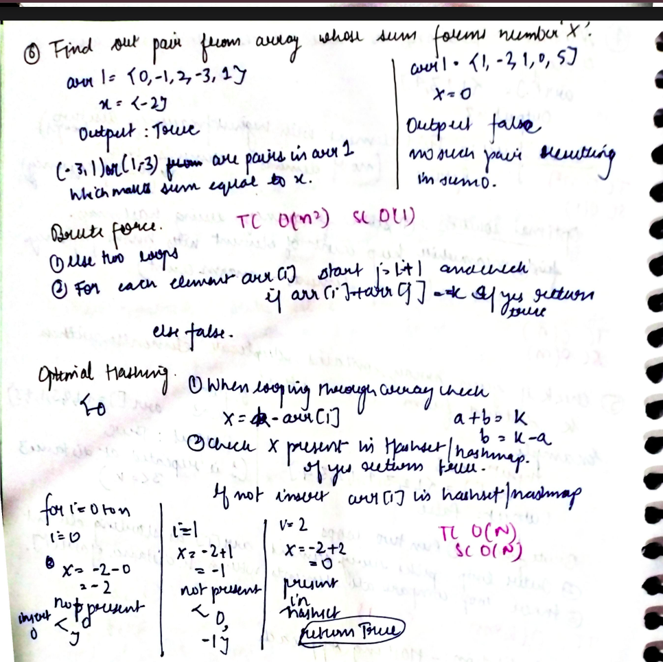

# Two Sum

Given an array of integers `nums` and an integer `target`, return indices of the two numbers such that they add up to target.

You may assume that each input would have exactly one solution, and you may not use the same element twice.

You can return the answer in any order.

[Problem Link-Leetcode](https://leetcode.com/problems/two-sum/description/)

```
Example 1:

Input: nums = [2,7,11,15], target = 9
Output: [0,1]
Explanation: Because nums[0] + nums[1] == 9, we return [0, 1].


Example 2:

Input: nums = [3,2,4], target = 6
Output: [1,2]


Example 3:

Input: nums = [3,3], target = 6
Output: [0,1]

```

---

## **Approach**:

## 

## **Solution**:

### **Brute Force**:

One brute force approach is to consider every pair of elements and check if their sum equals the target. This can be done using nested loops, where the outer loop iterates from the first element to the second-to-last element, and the inner loop iterates from the next element to the last element. However, this approach has a time complexity of O(n^2).

### Java

```Java
class Solution {
    public int[] twoSum(int[] nums, int target) {
        int n = nums.length;
        for (int i = 0; i < n - 1; i++) {
            for (int j = i + 1; j < n; j++) {
                if (nums[i] + nums[j] == target) {
                    return new int[]{i, j};
                }
            }
        }
        return new int[]{}; // No solution found
    }
}

```

Time Complexity: O(n^2)

Space Complexity O(1)

---

### **Best Approach**

1. Create an empty hash table to store elements and their indices.
2. Iterate through the array from left to right.
3. For each element nums[i], calculate the complement by subtracting it from the target: complement = target - nums[i].
4. Check if the complement exists in the hash table. If it does, we have found a solution.
5. If the complement does not exist in the hash table, add the current element nums[i] to the hash table with its index as the value.
6. Repeat steps 3-5 until we find a solution or reach the end of the array.
7. If no solution is found, return an empty array or an appropriate indicator.

This approach has a time complexity of O(n) since hash table lookups take constant time on average. It allows us to solve the Two Sum problem efficiently by making just one pass through the array.

#### Java

```Java
class Solution {
    public int[] twoSum(int[] nums, int target) {
        int [] ans=new int[2];
        HashMap<Integer, Integer>hmap=new HashMap<>();
        for(int i=0;i<nums.length;i++){
           int  complementary_no=target-nums[i];
           if(hmap.containsKey(complementary_no)){
            ans[0]=hmap.get(complementary_no);
            ans[1]=i;
            break;
           }
           hmap.put(nums[i], i);

        }
        return ans;
    }
}

```

#### Python

```python

class Solution:
    def twoSum(self, arr: List[int], target: int) -> List[int]:
        ans={}

        for i in range(len(arr)):
            diff=target-arr[i]

            if diff in ans:
                return [ans[diff],i]
            else:
                ans[arr[i]]=i

```

Time Complexity: O(n)

Space Complexity O(n)

---

**Materials To Read/Watch**

1. [C++ Solution](https://leetcode.com/problems/two-sum/solutions/4529514/optimal-solution-c-hashing)
