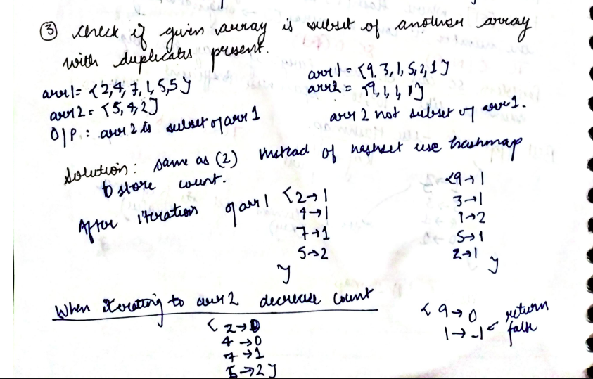

# Check if the given array is subset of another array with duplicates present

Given two arrays, arr1 and arr2, check if arr2 is a subset of arr1. You can assume there are no duplicates in both the arrays.

---

## **Input**:

Given two arrays, arr1 and arr2, check if arr2 is a subset of arr1.

```

Example-1:

Input:

arr1 = {2,4,7,1,5,5}

arr2 = {5,4,2}

Output: arr2 is a subset of arr1

Explanation: All elements of arr2 are present in arr1.


Example-2:

Input:

arr1 = {9,3,1,5,2,1}

arr2 = {9,1,1,1}

Output: arr2 is not a subset of arr1

Explanation: Element 1 is present twice in arr1 and thrice in arr2.


```

## **Approach**:



---

## **Solution**:

### **Optimized Approach**

#### Java

```java
class Solution{
static boolean checksubset(int[] arr1, int[] arr2) {
        HashMap<Integer, Integer> map = new HashMap<>();
        for (int i = 0; i < arr1.length; i++) {
            int freq = map.getOrDefault(arr1[i], 0);
            map.put(arr1[i], freq + 1);
        }

        for (int j = 0; j < arr2.length; j++) {

            if (map.containsKey(arr2[j])) {
                int num = map.get(arr2[j]);

                if (num == 0) {
                    return false;
                } else {
                    map.put(arr2[j], num - 1);
                }
            } else {
                return false;
            }
        }
        return true;
    }
}

```

---

#### Python

```python

def checksubsetwithduplicates(arr1,arr2):
    hashmap={}
    for ele in arr1:
        hashmap[ele]=hashmap.get(ele,0)+1
    for ele in arr2:
        count=hashmap.get(ele,0)
        if ele not in hashmap or hashmap[ele]==0:
            return False
        hashmap[ele]-=1

    return True


if __name__=="__main__":
    n=input("Enter size of array 1")
    ip_arr1=input("Enter array 1")
    arr1=[ int(x) for x in ip_arr1.split()]
    m=input("Enter size of array 2")
    ip_arr2=input("Enter array 2")
    arr2=[ int(x) for x in ip_arr2.split()]
    ans=checksubsetwithduplicates(arr1,arr2)
    if ans:
        print("arr2 is subset of arr1")
    else:
        print("arr2 is not subset of arr1")


```

Time Complexity: O(n+m)

Space Complexity O(n)

---

**Materials To Read**
