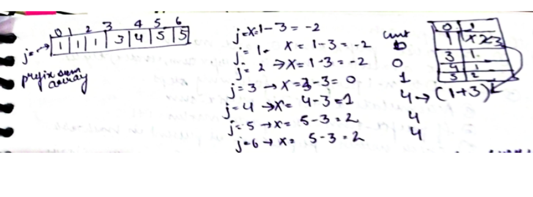

# Subarray Sum Equals K

Given an array of integers nums and an integer k, return the total number of subarrays whose sum equals to k.

A subarray is a contiguous non-empty sequence of elements within an array.

[Problem Link-Leetcode](https://leetcode.com/problems/subarray-sum-equals-k/description/)

```
Example 1:

Input: nums = [1,1,1], k = 2
Output: 2
Example 2:

Input: nums = [1,2,3], k = 3
Output: 2

```

---

## **Solution**:

### **Brute Force**:

Generate all subarrays and check the sum of subarrays (sum==k) if yes then increment count.
In other words,
Use 2 Nested For loops. Check for every i and j the sum of subarray Starting at Index I and ending at Index J and if this sum comes out to be equal to K then do count++

### Java

```Java

public class Main {
    public static int countSubarraysBruteForce(int[] arr, int k) {
        int n = arr.length;
        int count = 0;

        for (int i = 0; i < n; i++) {
            int sum = 0;
            for (int j = i; j < n; j++) {

                sum += arr[j];
                if (sum == k) {
                    count++;
                }
            }
        }

        return count;
    }
}

```

Time Complexity: O(n^2)

Space Complexity O(1)

---

### **Best Approach**

1. Create prefix sum array
2. create a hashmap the hashmap will contain prefixsum array elements as key and their frequency as value.
3. To handle the edge case i.e. suppose if we get sum==k put inside map(0,1)
4. suppose if we have a subarray whose sum is k that starts from index i and ends at index j.
   `pre_sum[i]` will be sum of all array elements till idx i, pre_sum[j] will be sum of all array elements till j
   we can say that `pre_sum[i]+k=pre_sum[j]`. ( as the sum of elements from i to j is k)
   therefore `pre_sum[i]=pre_sum[j]-k`
5. Iterate through the pre_sum array from j= 0 to n check in hashmap if there exists the number `(k-pre_sum[j])`. If yes then do `count=count+map.get(k-pre_sum[j])`.
   Put the current element inside the map if it doesn't exist and if it does then increment the count.

```
[-------pre_sum_array--------]
{--a--}
        {--k--}
{----------b--}


a+k=b
then a=b-k
given b you need to find if b-k  exists  inside the hashmap. if yes then we found the subarray with sum k

```

**DRY RUN**


#### Java

```Java

class Solution {
    public int subarraySum(int[] nums, int k) {
        HashMap<Integer, Integer> map=new HashMap<>();
        int n=nums.length;
        int [] pre_sum=new  int[n];
        Arrays.fill(pre_sum,0);
        pre_sum[0]=nums[0];
        int count=0;
        for (int i=1;i<n;i++){
            pre_sum[i]=pre_sum[i-1]+nums[i];
        }
        map.put(0,1);
        for(int i=0;i<n;i++){
            int x=pre_sum[i]-k;
             if(map.containsKey(x)){
                count+=map.get(x);

            }
        map.put(pre_sum[i],map.getOrDefault(pre_sum[i],0)+1);
        }
        return count;
    }
}

```

#### Python

```python
class Solution:
    def subarraySum(self, nums: List[int], k: int) -> int:
        #all subarray with sum k
        count=0
        map={}
        map[0]=1
        sum=0
        presum=[0]*len(nums)
        presum[0]=nums[0]
        for i  in range(1,len(nums)):
            presum[i]=presum[i-1]+nums[i]
        for ele in presum:
            x=ele-k
            if x in map:
                count=count+map[x]
            if ele not in map:
                map[ele]=1
            else:
                map[ele]+=1

        return count


```

Time Complexity: O(n)

Space Complexity O(n)

---

**Materials To Read/Watch**
