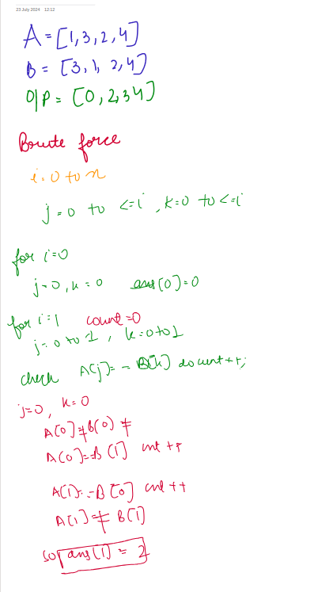
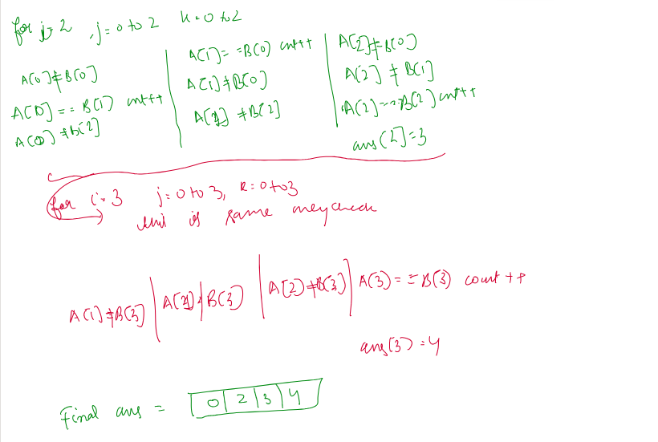
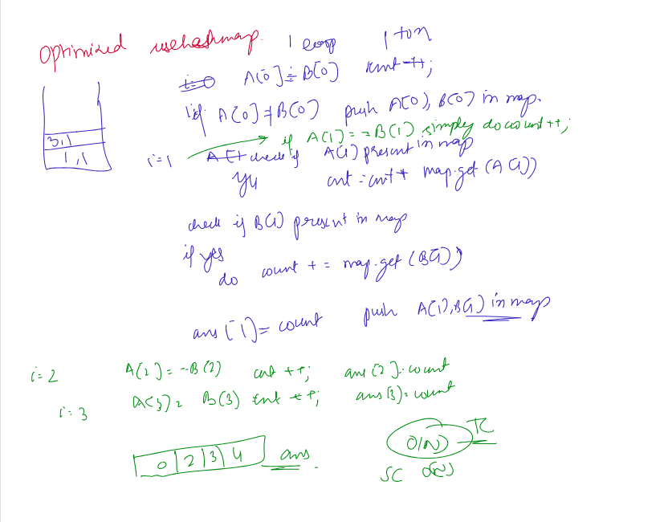

# Find the Prefix Common Array of Two Arrays

You are given two 0-indexed integer permutations A and B of length n.

A prefix common array of A and B is an array C such that C[i] is equal to the count of numbers that are present at or before the index i in both A and B.

Return the prefix common array of A and B.

A sequence of n integers is called a permutation if it contains all integers from 1 to n exactly once.

You can return the answer in any order.

[Problem Link-Leetcode](https://leetcode.com/problems/find-the-prefix-common-array-of-two-arrays/description/)

```
Example 1:

Input: A = [1,3,2,4], B = [3,1,2,4]

Output: [0,2,3,4]

Explanation: At i = 0: no number is common, so C[0] = 0.
At i = 1: 1 and 3 are common in A and B, so C[1] = 2.
At i = 2: 1, 2, and 3 are common in A and B, so C[2] = 3.
At i = 3: 1, 2, 3, and 4 are common in A and B, so C[3] = 4.


Example 2:

Input: A = [2,3,1], B = [3,1,2]

Output: [0,1,3]

Explanation: At i = 0: no number is common, so C[0] = 0.
At i = 1: only 3 is common in A and B, so C[1] = 1.
At i = 2: 1, 2, and 3 are common in A and B, so C[2] = 3.


```

---

## **Approach**:

## **Solution**:

### **Brute Force**:

 

1. Run a loop from i=0 to n initialise count=0
2. Run a loop from j=0 to <=i and k=0 to<=i.
3. Check if A[j]==B[k] if yes then do count++ and break
4. Outside j and k loop do ans[i]=count
5. Return ans
   We basically are checking all values of A and B till ith index.

### Java

```Java
class Solution {
    public int[] findThePrefixCommonArray(int[] A, int[] B) {
        int n=A.length;
     int[ ] ans=new int[n];
     for (int i=0;i<n;i++){
          int count=0;
        for (int j=0;j<=i;j++){
            for (int k=0;k<=i;k++){
                if(A[j]==B[k]){
                count++;
                 break;
            }
            }

        }
            ans[i]=count;

     }
     return ans;
    }
}

```

Time Complexity: O(n^2)

Space Complexity O(1)

---

### **Best Approach**



1. Use a hashmap to store frequency. Initialise count=0 and ans[n]={0}
2. Run a loop from i=1 to n.
3. for A[0], B[0] check if A[0]==B[0] if yes then simply do count++;
   if No then put A[0] and B[0] inside map.
   After this do ans[0]=count
4. for every i from 1 to n check
   if A[i]==B[i] then simply do count++
   else
   if A[i] in map do count+=map.get(A[i])
   if B[i ] in map do count+=map.get(B[i])
   do map[A[i]]+=1
   map[B[i]]+=1
5. Outside if else and inside for loop do ans[i]=count

#### Java

```Java
class Solution {
    public int[] findThePrefixCommonArray(int[] A, int[] B) {
       HashMap <Integer, Integer> map=new HashMap<>();
       int n=A.length;
       int [] ans=new int[n];
       int count=0;
       if (A[0]==B[0]){
        count=1;
    }
    else{
        map.put(A[0],1);
        map.put(B[0],1);
    }
    ans[0]=count;
    for(int i=1;i<A.length;i++){
        if (A[i]==B[i]){
            count++;
        }
        else{
            if(map.containsKey(A[i]) ){
                count+=map.get(A[i]);
            }
             if (map.containsKey(B[i])){
            count+=map.get(B[i]);
            }


        }
        map.put(A[i],map.getOrDefault(A[i],0)+1);
            map.put(B[i],map.getOrDefault(B[i],0)+1);


        ans[i]=count;


    }
    return ans;
}
}

```

#### Python

```python


```

Time Complexity: O(n)

Space Complexity O(n)

---

**Materials To Read/Watch**

1. [C++ Solution](https://leetcode.com/problems/two-sum/solutions/4529514/optimal-solution-c-hashing)
