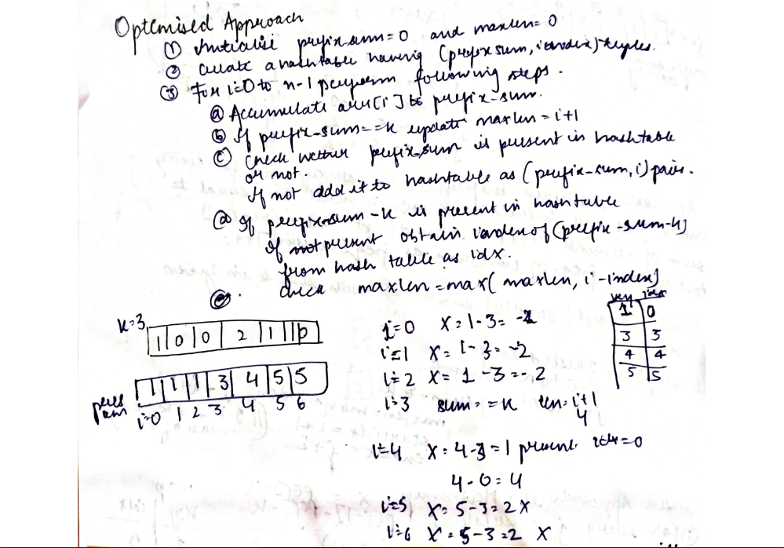

# Find largest/smallest subarray with sum k in Given Array

**NOTE** : Below explanation is for finding largest subarray with sum k . If you understand the intution and approach of this problem you can easily solve it for smallest subarray with sum k as well. I'm still providing the link to smallest subarray with sum k problem article. Check it below:
[Smallest subarray with sum k](https://www.geeksforgeeks.org/smallest-subarray-with-sum-k-from-an-array/)

Given an array of integers nums and an integer k, return the total number of subarrays whose sum equals to k.

A subarray is a contiguous non-empty sequence of elements within an array.

[Problem Link-Leetcode](https://leetcode.com/problems/subarray-sum-equals-k/description/)

```
Example 1:

Input: nums = [1,1,1], k = 2
Output: 2
Example 2:

Input: nums = [1,2,3], k = 3
Output: 2

```

---

## **Solution**:

### **Brute Force**:

Consider the sum of all the sub-arrays and return the length of the longest sub-array having the sum ‘k’. Time Complexity is of O(n^2).

### Java

```Java

static int lenOfLongSubarr(int[] arr, int N, int k)
  {
    int maxlength = 0;

    for (int i = 0; i < N; i++) {

      // Variable to store sum of subarrays
      int Sum = 0;

      // if maximum possible subarray length from i is equal to maxLength
      if( maxlength == N - i )
        break;

      for (int j = i; j < N; j++) {

        // Storing sum of subarrays
        Sum += arr[j];

        // if Sum equals K
        if (Sum == k) {

          // Update maxLength
          maxlength = Math.max(maxlength, j - i + 1);
        }
      }
    }

    // Return the maximum length
    return maxlength;
  }

```

Time Complexity: O(n^2)

Space Complexity O(1)

---

### **Best Approach**

1. Initialize prefix_sum = 0 and maxlen = 0.
2. Create a hash table having (prefix_sum, index) .
3. For i=0 to n-1 perform the following steps:
   1. Keep calculating prefix_sum[i]
   2. if prefix_sum ==k update maxlen=i+1
   3. Check wether prefix_sum is present in hash table or not.
   4. If not present add it to hash table as `(prefix_sum,i`) pair.
   5. If prefix_sum-k is present in hash table, then obtain the index `index=map[prefix_sum-k]`.
   6. Update `maxlen=max(maxlen, i-index)`



#### Java

```Java

class Solution{


    public static int lenOfLongSubarr (int arr[], int N, int k) {
        HashMap<Integer,Integer> map=new HashMap<>();

        int lcs=0;
        int  sum=0;
        for(int i=0;i<N;i++){
            sum=sum+arr[i];
            if(sum==k){
                lcs=Math.max(lcs,i+1);
            }
            else{
            int x=sum-k;
            if(map.containsKey(x)){
                int idx=map.get(x);
                // System.out.println(idx+" "+i);
                lcs=Math.max(lcs, i-idx);
            }
            }
            if(!map.containsKey(sum)){
            map.put(sum,i);
            }
        }
        // int j=;

        return lcs;

    }


}


```

#### Python

```python
#User function Template for python3

class Solution:
    def lenOfLongSubarr (self, arr, n, k) :
        #Complete the function
        ans=0
        pre_sum=0
        hashmap={}
        for i in range(0,n):
            pre_sum=pre_sum+arr[i]

            if pre_sum==k:
                ans=max(ans,i+1)  # 0 based indexing
            else:
                x=pre_sum-k
                if x in hashmap:
                    idx=hashmap[x]
                    ans=max(ans,i-idx)

            if pre_sum not in hashmap:
                hashmap[pre_sum]=i
        return ans


```

Time Complexity: O(n)

Space Complexity O(n)

---

**Materials To Read/Watch**

1. [GfG: Longest subarray having sum k](https://www.geeksforgeeks.org/longest-sub-array-sum-k/)
2. [Another good explanation !](https://takeuforward.org/arrays/longest-subarray-with-sum-k-postives-and-negatives/)
3. [Watch this video ](https://youtu.be/frf7qxiN2qU?feature=shared)
