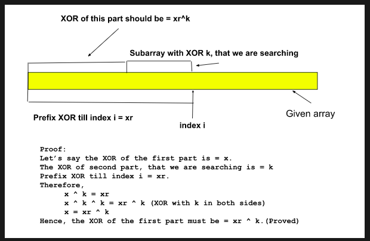

# Count the number of subarrays with given xor K

Problem Statement: Given an array of integers A and an integer B. Find the total number of subarrays having bitwise XOR of all elements equal to k.

[Problem Link-Interviewbit](https://www.interviewbit.com/problems/subarray-with-given-xor/)

```
Example 1:

Input Format:
 A = [4, 2, 2, 6, 4] , k = 6
Result:
 4
Explanation:
 The subarrays having XOR of their elements as 6 are  [4, 2], [4, 2, 2, 6, 4], [2, 2, 6], [6]

Example 2:

Input Format:
 A = [5, 6, 7, 8, 9], k = 5
Result:
 2
Explanation:
 The subarrays having XOR of their elements as 5 are [5] and [5, 6, 7, 8, 9]

```

---

## **Approach**:

## **Solution**:

### **Brute Force**:

1. Generate all possible subarrays and find the xor of each subarray.
2. If the xor==k do count++
3. Return count

### Java

```Java

public class Solution {

    public static int subarraysWithXorK(int []a, int k) {
        int n = a.length;
        int cnt = 0;
        for (int i = 0; i < n; i++) {
            int xorr = 0;
            for (int j = i; j < n; j++) {
                xorr = xorr ^ a[j];

                if (xorr == k) cnt++;
            }
        }
        return cnt;
    }
}

```

Time Complexity: O(N^2)

Space Complexity : O(1)

---

### **Best Approach**

Assume, the prefix XOR of a subarray ending at index i is xr. In that subarray, we will search for another subarray ending at index i, whose XOR is equal to k. Here, we need to observe that if there exists another subarray ending at index i, with XOR k, then the prefix XOR of the rest of the subarray will be xr^k. The below image will clarify the concept:



The steps are as follows:

1. First, we will declare a map to store the prefix XORs and their counts.
2. Then, we will set the value of 0 as 1 on the map.
3. Then we will run a loop(say i) from index 0 to n-1(n = size of the array).
4. For each index i, we will do the following:
   1. We will XOR the current element i.e. arr[i] to the existing prefix XOR.
   2. Then we will calculate the prefix XOR i.e. xr^k, for which we need the occurrence.
   3. We will add the occurrence of the prefix XOR xr^k i.e. mpp[xr^k] to our answer.
   4. Then we will store the current prefix XOR, xr in the map increasing its occurrence by 1.

Question: Why do we need to set the value of 0 beforehand?

Let’s understand this using an example. Assume the given array is [3, 3, 1, 1, 1] and k is 3. Now, for index 0, we get the total prefix XOR as 3, and k is also 3. So, the prefix XOR xr^k will be = 3^3 = 0. Now, if the value is not previously set for the key 0 in the map, we will get the default value 0 and we will add 0 to our answer. This will mean that we have not found any subarray with XOR 3 till now. But this should not be the case as index 0 itself is a subarray with XOR k i.e. 3.
So, in order to avoid this situation we need to set the value of 0 as 1 on the map beforehand.

#### Java

```Java

public class Solution {
    public int solve(ArrayList<Integer> A, int B) {
        HashMap <Integer, Integer> map=new HashMap<>();
        int prexor=0;
        int count=0;
        map.put(0,1);
        for(int i=0;i<A.size();i++){
            prexor^=A.get(i);
            if (map.getOrDefault(prexor^B,0)!=0){
                count+=map.get(prexor^B);

            }
            map.put(prexor,map.getOrDefault(prexor,0)+1);

        }
        return count;
    }
}


```

#### Python

```python

class Solution:
    # @param A : list of integers
    # @param B : integer
    # @return an integer
    def solve(self, A, B):
        hmap={}
        xor=0
        count=0
        hmap[0]=1
        # maxcount=0
        for ele in A:
            xor=xor^ele
            find=xor^B
            if   hmap.get(find,0)!=0:
                count+=hmap.get(find)
            hmap[xor]=hmap.get(xor,0)+1

        return count


```

Time Complexity: O(N) or O(N*logN) depending on which map data structure we are using, where N = size of the array.
Reason: For example, if we are using an unordered_map data structure in C++ the time complexity will be O(N) but if we are using a map data structure, the time complexity will be O(N*logN). The least complexity will be O(N) as we are using a loop to traverse the array. Point to remember for unordered_map in the worst case, the searching time increases to O(N), and hence the overall time complexity increases to O(N2).

Space Complexity: O(N) as we are using a map data structure.

---

**Materials To Read/Watch**

1. [Read best blog here](https://takeuforward.org/data-structure/count-the-number-of-subarrays-with-given-xor-k/)

Note: This article has used explanations from this (source)[https://takeuforward.org/data-structure/count-the-number-of-subarrays-with-given-xor-k/] and so the credit for the explanation goes to them.
