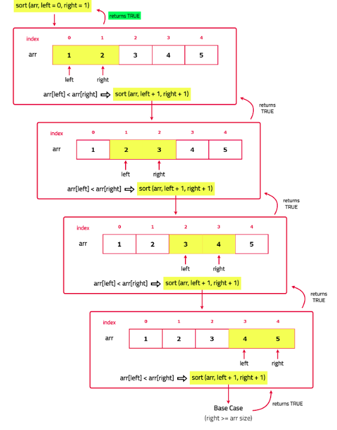

# Check if the array is sorted

Given an array nums of n integers, return true if array nums is sorted else false.

[Problem Link]()

```
Example 1

Input : nums = [1, 2, 3, 4, 5]
Output : true
Explanation : For all i (1 <= i <= 4) it holds nums[i] <= nums[i+1], hence it is sorted and we return true.

Example 2

Input : nums = [1, 2, 1, 4, 5]
Output : false
Explanation : For i == 2 it does not hold nums[i] <= nums[i+1], hence it is not sorted and we return false.

Example 3

Input : nums = [1]
Output : true

```

---

## **Approach**:



## **Solution**:

1. If the array has 0 or 1 elements, it is already sorted. So, return true.
   Use a helper function sort that takes the array and two pointers, left and right, to compare elements.
2. In the helper function, check if the array is sorted by comparing elements at the left and right pointers; if right reaches the end of the array, the array is sorted, so return true; if the element at left is greater than the element at right, return false because the array is not sorted; otherwise, move both pointers to the next elements and call the helper function recursively.

### Java

```Java

class Solution {
    boolean sorted(ArrayList<Integer> nums, int left, int right){
        if(right>=nums.size()){
            return true;
        }
        if(nums.get(left)>nums.get(right)){
            return false;
        }
        return sorted(nums, left+1, right+1);
    }
    public boolean isSorted(ArrayList<Integer> nums) {
        //your code goes here
        return sorted(nums, 0 ,1);
    }
}

```

```

Time Complexity O(N): The time complexity of this recursive solution is O(N) because the helper function makes a recursive call for each element in the array, moving from the beginning to the end of the array.

Space Complexity O(N): The space complexity of this solution is O(N) Due to the recursion stack. Each recursive call adds a new frame to the call stack, and in the worst case, there will be n frames on the stack (one for each call).

```

---

**Materials To Read/Watch**
