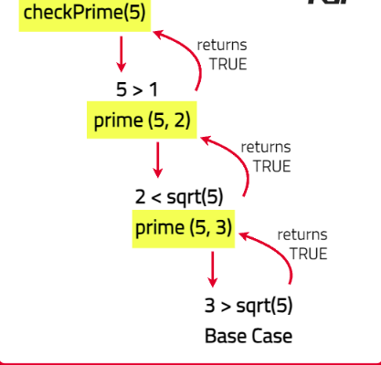

# Check if a number is prime or not

Given an integer num, return true if it is prime otherwise false.

A prime number is a number that is divisible only by 1 and itself.

[Problem Link]()

```

Example 1

Input : num = 5
Output : true
Explanation : The factors of 5 are 1 and 5 only.

So it satisfies the prime number condition.

Example 2

Input : num = 15
Output : false
Explanation : The factors of 15 are 1, 3, 5, 15 only.

As the number has factors other than 1 and itself, So it is not a prime number.

```

---

## **Approach**:



## **Solution**:

1. First, handle the base cases: If the number is less than or equal to 1, return false because 0 and 1 are not prime. If the number is greater than 1, start checking for divisibility from 2.
2. Define a recursive helper function prime(num, x) where num is the number to be checked and x is the current divisor to check.
3. In the helper function --> if x is greater than the square root of num, return true indicating that num is a prime number. If num is divisible by x (i.e., num % x == 0), return false indicating that num is not a prime number. If neither condition is met, recursively call the function with the next divisor x + 1.

### Java

```Java

class Solution {
    // Main method for testing the checkPrime function
    public static void main(String[] args) {
        Solution solution = new Solution();
        int num = 7;
        boolean result = solution.checkPrime(num);
        System.out.println(result);
    }

    public boolean checkPrime(int num) {
    // 0 and 1 are not prime numbers
        if (num <= 1) {
            return false;
        }
       // Call the helper function to check for primality
        return prime(num, 2);
    }

    private boolean prime(int num, int x) {
        if (x > Math.sqrt(num)) {
            return true;
        }
       // Found a divisor, so the number is not prime
        if (num % x == 0) {
            return false;
        }
        // Recursive call with the next divisor
        return prime(num, x + 1);
    }
}


```

```

Time Complexity O(sqrt(N)) because we only need to check for divisors up to the square root of the number.

Space Complexity : O(sqrt(N)) due to the recursion stack depth which can grow up to the square root of the number.

```

---

**Materials To Read/Watch**
