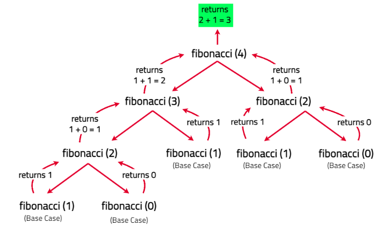

# Fibonacci Number

The Fibonacci numbers, commonly denoted F(n) form a sequence, called the Fibonacci sequence, such that each number is the sum of the two preceding ones, starting from 0 and 1. That is,

F(0) = 0, F(1) = 1
F(n) = F(n - 1) + F(n - 2), for n > 1.

Given n, calculate F(n).

[Problem Link]()

```

Example 1

Input : n = 2
Output : 1
Explanation : F(2) = F(1) + F(0) => 1 + 0 => 1.

Example 2

Input : n = 3
Output : 2
Explanation : F(3) = F(2) + F(1) => 1 + 1 => 2.

Example 3

Input : n = 4
Output :3

```

---

## **Approach**:



## **Solution**:

1. Define a recursive function that returns 0 if n is 0, and 1 if n is 1 (base cases).
2. For n > 1, return the sum of the Fibonacci numbers for n-1 and n-2 (recursive case).
3. Call the function with the desired n to get the Fibonacci number.

### Java

```Java
class Solution {
    public int fib(int n) {
        if (n==0){
            return 0;
        }
        if(n==1){
            return 1;
        }
        return fib(n-1)+fib(n-2);
        //your code goes here
    }
}


```

```

Time Complexity O(2^N) — Each function call makes two more calls (for n-1 and n-2), resulting in an exponential growth in the number of calls.

Space Complexity O(N)— The call stack grows with each recursive call, using N stack frames, so the space complexity is proportional to the recursion depth.

```

---

**Materials To Read/Watch**
