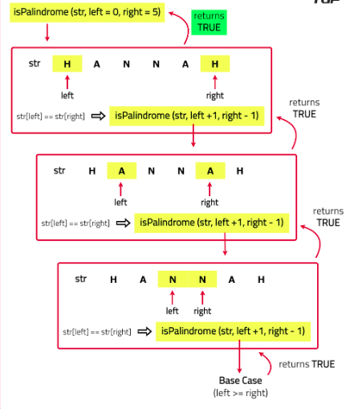

# Check if string is palindrome or not

Given a string s, return true if the string is palindrome, otherwise false.

A string is called palindrome if it reads the same forward and backward.

[Problem Link]()

```
Example 1

Input : s = "hannah"
Output : true
Explanation : The string when reversed is --> "hannah", which is same as original string , so we return true.

Example 2

Input : s = "aabbaaa"
Output : false
Explanation : The string when reversed is --> "aaabbaa", which is not same as original string, So we return false.

Example 3

Input : s = "aba"
Output :
true

```

---

## **Approach**:

1. Start by comparing the first and last characters of the string. If the characters match, move inward by increasing the starting index and decreasing the ending index. Check if the substring between these indices is also a palindrome.
2. Continue this process until the starting index is greater than or equal to the ending index. If at any point the characters do not match, the string is not a palindrome.
3. If all the characters are successfully compared and they all match, the string is a palindrome.



## **Solution**:

#### Java

```Java

class Solution {
    // Method to check if a string is a palindrome
    public boolean palindromeCheck(String s) {
        // Start recursion with the whole string
        return isPalindrome(s, 0, s.length() - 1);
    }

    // Helper method to perform the recursive check
    private boolean isPalindrome(String s, int left, int right) {
        // Base Case: If the start index is greater than or equal to the end index, it's a palindrome
        if (left >= right) {
            return true;
        }
        // Check if characters at the current positions are the same
        if (s.charAt(left) != s.charAt(right)) {
            return false; // Characters do not match, so it's not a palindrome
        }
        // Recur for the next set of characters
        return isPalindrome(s, left + 1, right - 1);
    }

    // Main method to test the palindromeCheck function
    public static void main(String[] args) {
        Solution solution = new Solution();
        System.out.println(solution.palindromeCheck("hannah")); // Output: true
        System.out.println(solution.palindromeCheck("aabbaaa")); // Output: false
        System.out.println(solution.palindromeCheck("aba")); // Output: true
    }
}


```

#### Python

```python


```

Time Complexity: O(N) — The function makes N recursive calls to reach the base case, so the time complexity is proportional to the number of recursive calls

Space Complexity : O(N) — The call stack grows with each recursive call, using N stack frames, so the space complexity is proportional to the depth of recursion.

---

**Materials To Read/Watch**
