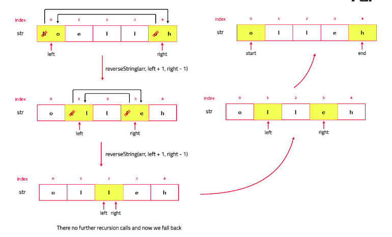

# Reverse a string

Given an input string as an array of characters, write a function that reverses the string.

[Problem Link]()

```
Example 1

Input : s = ["h", "e", "l", "l", "o"]
Output : ["o", "l", "l", "e", "h"]
Explanation : The given string is s = "hello" and after reversing it becomes s = "olleh".

Example 2

Input : s = ["b", "y", "e" ]
Output : ["e", "y", "b"]
Explanation : The given string is s = "bye" and after reversing it becomes s = "eyb".

Example 3

Input : s = ["h", "a", "n", "n", "a", "h"]
Output :
["h", "a", "n", "n", "a", "h"]


```

---

## **Approach**:

1. Identify the Base Case: Determine the condition under which the recursion should stop. For reversing a string, the recursion stops when the left index is greater than or equal to the right index. This indicates that we have reached the middle of the string and all necessary character swaps have been made.
2. Swap Characters at Indices: Perform the swap operation between the characters at the current left and right indices. This action exchanges the characters at the ends of the string segment being processed, which moves towards reversing the string.
3. Make Recursive Calls: After swapping, call the recursive function again with updated indices: increment the left index and decrement the right index. This step processes the next pair of characters moving inward until the base case is met.



## **Solution**:

#### Java

```Java

import java.util.*;

class Solution {
    /* Recursive function to reverse the
    string character by character */
    private void reverse(Vector<Character> s, int left, int right) {

        // Base case
        if (left >= right) return;

        // Swap characters at left and right positions
        char temp = s.get(left);
        s.set(left, s.get(right));
        s.set(right, temp);

        // Recursive call with updated indices
        reverse(s, left + 1, right - 1);
    }

    // Function to reverse the given string
    public Vector<Character> reverseString(Vector<Character> s) {
        int left = 0;
        int right = s.size() - 1;
        reverse(s, left, right);
        return s;
    }

    // Main function
    public static void main(String[] args) {
        Solution solution = new Solution();
        Vector<Character> s = new Vector<>();
        s.add('h');
        s.add('e');
        s.add('l');
        s.add('l');
        s.add('o');

        // Function call to reverse the given string
        Vector<Character> reversed = solution.reverseString(s);
        System.out.println(reversed);
    }
}


```

#### Python

```python


```

Time Complexity: O(N) - Each character in the string is processed exactly once, resulting in a linear time complexity relative to the length of the string.

Space Complexity: O(N) - This is due to the recursion stack used in the process. In the worst case, the depth of the recursion is equal to the length of the string, leading to linear space complexity.

---

**NOTE: For very large numbers, recursion can lead to a stack overflow due to too many nested function calls.**

**Materials To Read/Watch**
