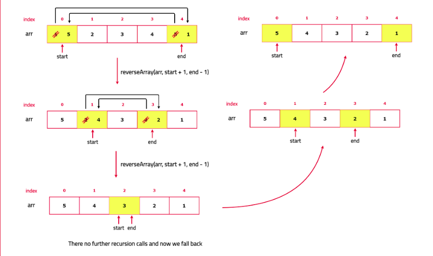

# Reverse an array

Given an array nums of n integers, return reverse of the array.

[Problem Link]()

```

Example 1

Input : nums = [1, 2, 3, 4, 5]
Output : [5, 4, 3, 2, 1]

Example 2

Input : nums = [1, 3, 3, 3, 5]
Output : [5, 3, 3, 3, 1]

Example 3

Input : nums = [1, 2, 1]
Output : [1, 2, 1]

```

---

## **Approach**:



## **Solution**:

1. Start with two pointers p1 and p2, for example: one at the beginning of the array and one at the end. Swap the elements at these two pointers.
2. Move the left pointer one step to the right and the right pointer one step to the left. Repeat the swap operation until the two pointers meet or cross each other.
3. Post swapping, call the recursion to perform the same operations again on the next pair of elements.
4. Return the reversed array.

### Java

```Java
class Solution {
    void reverse(int [] nums, int left, int right){
        if(left>=right){
            return ;
        }
        int temp=nums[left];
        nums[left]=nums[right];
        nums[right]=temp;
        reverse(nums, left+1, right-1);
    }

    public int[] reverseArray(int[] nums) {
        //your code goes here
        reverse(nums, 0, nums.length-1);
        return nums;
    }
}

```

```

Time Complexity: O(N) The time complexity is O(N) because we perform a constant-time swap operation for each element pair.

Space Complexity : O(N) The space complexity is O(N) due to the recursion stack.

```

---

**Materials To Read/Watch**
