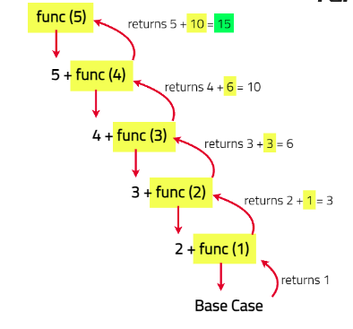

# Sum of digits in a given number

Given an integer num, repeatedly add all its digits until the result has only one digit, and return it.

[Problem Link]()

```
Example 1

Input : num = 529
Output : 7
Explanation : In first iteration the digits sum will be = 5 + 2 + 9 => 16
In second iteration the digits sum will be 1 + 6 => 7.
Now single digit is remaining , so we return it.


Example 2

Input : num = 101
Output : 2
Explanation : In first iteration the digits sum will be = 1 + 0 + 1 => 2
Now single digit is remaining , so we return it.

```

---

## **Approach**:

1. Base Case: If the number is 0, return 0 as there are no more digits to process.
2. Recursive Case:
   1. Compute the last digit of the number using number % 10.
   2. Compute the remaining number by performing integer division number / 10.
   3. Make a recursive call with the remaining number and add the last digit to the result of this call.



## **Solution**:

#### Java

```Java

class Solution {
    public int addDigits(int num) {
        //your code goes here
        if(num<10){
            return num;
        }
        int sum=0;
        while(num>0){
            sum+=num%10;
            num=num/10;
        }
        return addDigits(sum);
    }
}


```

#### Python

```python


```

Time Complexity: O(N) — The function makes N recursive calls to reach the base case, so the time complexity is proportional to the number of recursive calls

Space Complexity : O(N) — The call stack grows with each recursive call, using N stack frames, so the space complexity is proportional to the depth of recursion.

---

**NOTE: For very large numbers, recursion can lead to a stack overflow due to too many nested function calls.**

**Materials To Read/Watch**
