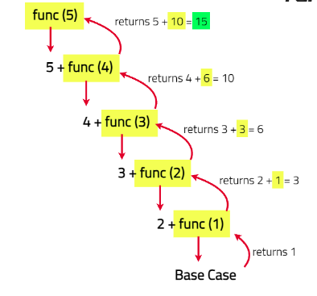

# Sum of first N numbers

Given an integer N, return the sum of first N natural numbers.

**Example 1**:

```
Input : N = 4

Output : 10

Explanation : first four natural numbers are 1, 2, 3, 4.

Sum is 1 + 2 + 3 + 4 => 10.

```

**Example 2**:

```
Input : N = 2

Output : 3

Explanation : first two natural numbers are 1, 2.

Sum is 1 + 2 => 3.

```

**Example 3**:

```
Input : N = 10

Output :
55

```

**Approach**:

1. Define a recursive function that returns 0 when N is 0 (base case).
2. For any other N, return N plus the recursive call with N − 1.
3. The sum is accumulated as the recursion unwinds from N down to 0.



**Solution**:

```java

class Solution {
    public int NnumbersSum(int N) {
        // Base case: if N is 0, return 0
        if (N == 0) return 0;
        // Recursive case: add N to the sum of N-1
        return N + NnumbersSum(N - 1);
    }

    public static void main(String[] args) {
        Solution solution = new Solution();
        int N = 10; // Example input
        System.out.println("Sum of first " + N + " numbers is " + solution.NnumbersSum(N));
    }
}


```

Time Complexity: O(N) — The function makes N recursive calls to reach the base case, so the time complexity is proportional to the number of calls made

Space Complexity : O(N) — In the worst case, the recursion stack space would be full with all the function calls waiting to get completed and that would make it an O(N) recursion stack space
